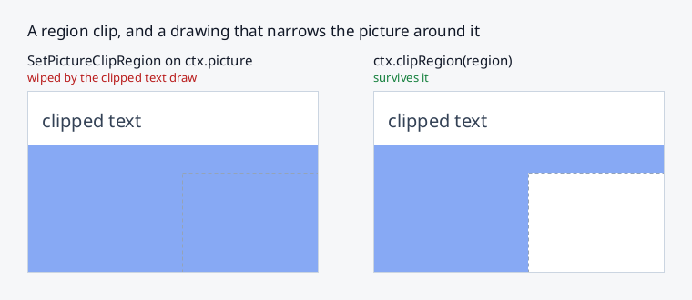
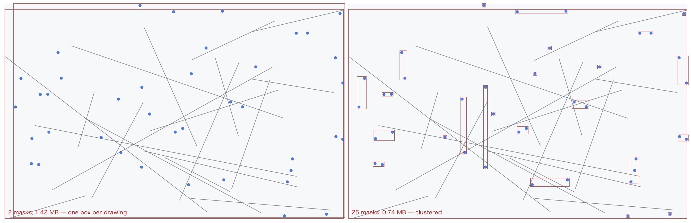

# 2d rendering context

`drawable.getContext('2d')` returns a context implementing a subset of the
HTML [CanvasRenderingContext2D](https://html.spec.whatwg.org/multipage/canvas.html#2dcontext)
API. It is backed by the XRender extension: fills, gradients, composition and
glyph drawing are executed **on the X server**, so pixel data does not travel
over the connection for most operations.

On windows, drawing goes into an offscreen backing pixmap and is presented
in single blits (double buffering — flicker-free by default; see
[window.md](window.md)). On pixmaps the context draws directly.
`getImageData` reads the backing pixmap on double-buffered windows, so it is
valid even where the window is occluded.

```js
const ctx = wnd.getContext('2d');
ctx.fillStyle = 'rgba(255, 0, 0, 0.5)';
ctx.fillRect(0, 0, 100, 100);
```

## Properties

- `ctx.canvas` — the owning drawable (window or pixmap), like in the browser
- `ctx.width`, `ctx.height` — drawable size
- `ctx.fillStyle`, `ctx.strokeStyle` — a CSS color string, a premultiplied
  `[r, g, b, a]` array (0..1 floats), a `CanvasGradient`, a `CanvasPattern`,
  or a `Picture`.
  Named colors, `rgb[a]()`, `hsl[a]()` and hex in all four lengths
  (`#rgb`, `#rgba`, `#rrggbb`, `#rrggbbaa`) are accepted; anything
  unparseable throws rather than drawing something arbitrary. See
  **Color** below for what alpha does
- `ctx.lineWidth`, `ctx.lineCap`, `ctx.lineJoin`, `ctx.miterLimit` — stroke
  geometry, including `'round'` caps and joins (rendered as triangle-fan
  disks unioned with the stroke mesh). A join whose inner corner would fall
  outside the two segments meeting there — a hairpin, or any turn tight
  relative to how short they are — is built from the segments' own ends
  instead, so the stroke of a path stays within half a line width of it
  (plus the miter itself, which `miterLimit` bounds)
- `ctx.setLineDash(segments)`, `ctx.getLineDash()`, `ctx.lineDashOffset` —
  canvas-spec dashes: an empty list is solid, an odd-length list doubles,
  negative/non-finite values invalidate the call, `getLineDash()` returns a
  copy, and the state participates in `save()`/`restore()`. Dashing splits
  the flattened polyline by arc length, so caps apply to each dash; on
  closed subpaths the pattern continues around the loop (no cap at the seam
  unless a gap lands there)
- `ctx.globalAlpha` — multiplies fills, strokes, `fillRect` and `drawImage`
  (not text)
- `ctx.shadowColor`, `ctx.shadowBlur`, `ctx.shadowOffsetX`,
  `ctx.shadowOffsetY` — drop shadows, off by default (a transparent
  `shadowColor`). See **Shadows** below
- `ctx.globalCompositeOperation` — Porter-Duff subset mapped to XRender ops:
  `source-over` (default), `copy`, `destination-over`, `source-in`,
  `destination-in`, `source-out`, `destination-out`, `source-atop`,
  `destination-atop`, `xor`, `lighter`. With a shape/clip mask the op only
  applies inside the mask coverage
- `ctx.font` — CSS-ish font string (`'bold italic 40px "DejaVu Sans"'`),
  resolved through fontconfig; see [fonts.md](fonts.md)

Everything that puts ink on the surface goes through the clip: fills,
strokes, images, text (`fillText`, `TextLayout.draw`) and the vector shapes
`SvgView` draws. Rectangular clips take a server-side fast path
(`SetPictureClipRectangles`); non-rectangular ones build an a8 mask; and an
XFIXES region is a third kind the server applies itself — see
[Region clips](#region-clips).

## Color

XRender colors are **premultiplied**: each of `r`, `g` and `b` is already
scaled by `a`, so all three must be `<= a`. Color *strings* are converted
for you — `'rgba(255, 0, 0, 0.5)'` reaches the server as
`[0.5, 0, 0, 0.5]` — but an **array is taken as already premultiplied and
passes through untouched**:

```js
ctx.fillStyle = 'rgba(255, 0, 0, 0.5)'; // half-alpha red
ctx.fillStyle = [0.5, 0, 0, 0.5]; // the same thing
ctx.fillStyle = [1, 0, 0, 0.5]; // NOT half-alpha red: out of gamut
```

The last line is the mistake to know about. It is not rejected — the
protocol allows it — but it renders brighter than any real color at that
alpha, and over a white background it clamps to the same pixels as the
correct value, so it tends to look fine until something dark is underneath.
White at half alpha is `[0.5, 0.5, 0.5, 0.5]`, not `[1, 1, 1, 0.5]`.

`cssColor(value)` (exported from the package) does the conversion, returning
premultiplied `[r, g, b, a]` in 0..1, or `null`. Gradient stops go through
the same path, so `addColorStop(0, 'rgba(255, 0, 0, 0.5)')` is right too.

Two companions for the places premultiplied is the *wrong* form, both
exported alongside it:

- `cssColorStraight(value)` — the same parse with **straight** alpha.
  **OpenGL** needs this: `glClearColor` and material colours take
  unassociated components, and premultiplied ones render translucent
  colours dark.
- `premultiply([r, g, b, a])` — converts. Interpolating two colours wants
  both: lerp in straight space, then scale once at the end, because a round
  trip back to an `rgba()` string only closes if the components were never
  scaled. Premultiplying twice is the failure this pair exists to prevent —
  `rgba(255, 0, 0, 0.5)` becomes `rgba(128, 0, 0, 0.5)`, a colour half as
  bright at the same alpha.

Set `NTK_STRICT_COLORS=1` to make a component outside 0..1 throw instead of
being clamped (it wires up x11's `Render.strictColors`); ntk's own test run
sets it. Note what that does *not* cover: an unpremultiplied `[1, 0, 0, 0.5]`
is inside 0..1 on every component, so only rendering catches it.

## State and transforms

- `save()` / `restore()` — full state stack: styles, line settings, font,
  text alignment, shadow, `globalAlpha`, composite op, transform and clip
- `translate(x, y)`, `rotate(angle)`, `scale(x[, y])`,
  `transform(a, b, c, d, e, f)`, `setTransform(...)`, `resetTransform()`,
  `getTransform()` → `{a, b, c, d, e, f}`

The transform applies to path commands as they are recorded, to
`fillRect`/`strokeRect`/`clearRect`, and to `drawImage` (server-side, via
the picture transform). **Text is the exception**: the translation applies
to the anchor point, but glyphs are not rotated/scaled — size text via
`ctx.font`.

## Rectangles and images

- `fillRect(x, y, w, h)` — respects clip, transform, `globalAlpha` and the
  composite op
- `fillRects(rects)` — batched `fillRect`: `rects` is an array of
  `[x, y, w, h]` quadruples or one flat `[x0, y0, w0, h0, x1, ...]` array;
  rectangles with non-positive width or height are skipped. Semantically it
  is `fillRect` once per rectangle — same style, alpha, composite op, clip
  and damage reporting — but a solid-colour `fillStyle` under an identity
  transform and a rectangular (or absent) clip sends the whole list as a
  **single `Render.FillRectangles` request**, which is what makes
  many-small-rectangles frames (terminal cell backgrounds, sparkline bars,
  heat maps, row striping) cheap. Gradient/pattern/`Picture` styles,
  transforms and non-rectangular clips fall back to the per-rectangle loop.
  Batching *paths* the same way — many subpaths in one `fill()`/`stroke()` —
  is a different trade, because a path pays for one mask over all of them;
  see [Many pieces in one path](#many-pieces-in-one-path-what-the-mask-costs)
- `strokeRect(x, y, w, h)` — outlines a rect without touching the current path
- `clearRect(x, y, w, h)` — resets to nothing (honors clip + transform).
  What "nothing" is depends on the target: **transparent black** on a
  drawable with an alpha channel — a depth-32 ARGB window, see
  [Transparent windows](window.md#transparent-windows) — so a compositor
  shows what is behind it, and **opaque white** anywhere else, since a
  depth-24 window has no alpha to write and white is the paper it starts from
- `drawImage(image, dx, dy)` / `drawImage(image, dx, dy, dw, dh)` /
  `drawImage(image, sx, sy, sw, sh, dx, dy, dw, dh)` — draws an ntk
  [`Image`](images.md) (decoded PNG/JPEG). The image uploads to the server
  once and is cached; scaling (and any affine transform) happens server-side
  with bilinear filtering. Respects clip and `globalAlpha`. `image` can also
  be a [`Surface`](surface.md) (pixels the server drew, including a8 coverage
  surfaces that paint in the current `fillStyle`), anything else exposing
  `width`/`height`/`picture(app)`, another ntk 2d context (server-side
  composite of the whole drawable) or a node-canvas-like object exposing
  `image.context.getImageData()` (pixels are uploaded). Under a rectangular
  clip the clip goes to the server directly, rather than through a
  full-surface mask
- `ctx.destroy()` / `Symbol.dispose` — release the context's server-side
  resources: its GCs, its Picture and its masks. Solid-colour sources are
  cached on the `App`, shared across contexts, and freed with `app.close()`.
  Needed only for contexts created dynamically, such as one per
  [`Surface`](surface.md); a context on a window lives as long as the window.
  A context dropped without it still releases its GCs through a finalizer,
  as `Pixmap` and `Picture` do for theirs
### Pixels

Pixel access follows the canvas API: `ImageData` is straight
(non-premultiplied) RGBA in a `Uint8ClampedArray`, rows top to bottom, and
ntk converts to and from the drawable's own layout at the boundary.

- `getImageData(x, y, w, h)` — resolves to an `ImageData`. A trailing
  `cb(err, imageData)` is still accepted. Reads the backing pixmap on
  double-buffered windows, so it is valid even where the window is occluded
- `putImageData(data, x, y[, dirtyX, dirtyY, dirtyWidth, dirtyHeight])` —
  writes straight RGBA back, optionally only part of the source
- `createImageData(w, h)` / `createImageData(imagedata)` — a blank
  `ImageData`; the second form copies the size, not the pixels

```js
const img = await ctx.getImageData(0, 0, 64, 64);
img.data[0] = 255; // red channel of the top-left pixel
ctx.putImageData(img, 0, 0);
```

What the drawable actually holds is none of those things — `GetImage`
returns words in the *server's* `image_byte_order` (a different handshake
field from the one the connection speaks), the channel positions come from
the visual's masks, anything XRender composited into is premultiplied, and a
depth-24 drawable's fourth byte is undefined padding rather than opacity.
Converting costs a pass over the pixels: roughly 0.04 ms for a 128×128 read,
0.7 ms at 640×480, 4.6 ms at 1920×1080.

- `readPixels(x, y, w, h)` — the way out when you want the server's own
  bytes, for handing straight back to `PutImage` or into a codec. Resolves to
  `{ width, height, data, depth, bitsPerPixel, byteOrder, masks,
  premultiplied }`, so unlike a bare `GetImage` the bytes say what they mean.
  `byteOrder` is `'lsb'` or `'msb'`; `masks.alpha` is 0 when the drawable has
  no alpha channel

## Paths

Full canvas path surface:

- `beginPath()`, `moveTo()`, `lineTo()`, `closePath()`
- `bezierCurveTo()`, `quadraticCurveTo()` — flattened adaptively
  (error-bounded subdivision in device pixels, so curves stay smooth at any
  transform scale)
- `arc(x, y, r, a0, a1[, ccw])`, `ellipse(x, y, rx, ry, rot, a0, a1[, ccw])`,
  `arcTo(x1, y1, x2, y2, r)` — arcs are flattened from their own geometry
  rather than by subdividing the curves they lower to, so they cost the
  fewest chords the tolerance allows instead of the next power of two (see
  [How curves are flattened](#how-curves-are-flattened))
- `rect(x, y, w, h)`, `roundRect(x, y, w, h, radii)` — radii like the spec:
  a number, or an array of 1–4 numbers / `{x, y}` pairs. A rounded rect on
  integer geometry fills/strokes through cached server-side corner glyphs
  instead of rasterization (see
  [Rounded rectangles: corner glyphs](#rounded-rectangles-corner-glyphs))
- `fill([path][, fillRule])` — `'nonzero'` (default) or `'evenodd'`;
  rasterized here or on the server depending on size (see
  [Where drawings are rasterized](#where-drawings-are-rasterized))
- `stroke([path])` — extrudes the polyline (extrude-polyline) and renders
  triangles; honors line dashes, round caps/joins, clip, `globalAlpha` and
  the composite op. Round-cap/join disks overlap the stroke body, so their
  coverage is accumulated in a clamped a8 mask and composited in a single
  pass — semi-transparent strokes (`globalAlpha < 1` or an alpha stroke
  style) do not double-darken at the overlaps. Disks are sized by the same
  flatness tolerance as any other arc, so a 1px round cap is a triangle and
  a very thick one stays smooth past where the old fixed ceiling of 32
  segments started to show. A **closed** subpath is cut in the middle of one
  of its edges before extrusion, so every one of its vertices is a join and
  none of them is an end — a stroked rectangle has four identical corners,
  and `lineCap` has nothing to apply to (per the spec, caps belong to the
  ends of open subpaths)
- `clip([path][, fillRule])` — intersects the clip region; restored by
  `restore()`
- `clipRegion(region)` — intersects the clip with a server-side XFIXES
  region. Also restored by `restore()`; see
  [Region clips](#region-clips)
- `isPointInPath([path, ]x, y[, fillRule])` — hit test in canvas (device)
  coordinates

## Region clips

A **region** is a set of rectangles the X server owns. It is how X describes
a non-rectangular area: the damage an expose reports, a window's SHAPE, or
what a compositor has left to paint after subtracting the windows in front.
`ctx.clipRegion(region)` makes one a clip:

```js
const region = await app.createRegion([
  { x: 0, y: 0, width: 100, height: 100 },
  { x: 140, y: 140, width: 60, height: 60 }
]);

ctx.save();
ctx.clipRegion(region);
ctx.fillStyle = 'red';
ctx.fillRect(0, 0, 200, 200); // only the two rectangles are painted
ctx.restore(); // the clip is lifted, as after clip()
region.destroy();
```

`app.createRegion(rects)` is a promise because XFIXES is loaded on first use,
not because a region costs a round trip — it does not, and neither does any
operation on one except `fetch()`.

What it is:

- **Scoped like `clip()`.** `restore()` takes it off and nothing else does.
  Region, rectangle and path clips intersect in any combination and any
  order.
- **In device pixels**, ignoring the current transform — unlike `clip()`,
  whose path goes through it. A region is a set of integer rectangles, so
  there is no honest way to rotate or scale one; `region.translate(dx, dy)`
  moves one server-side if that is what you want.
- **Applied by the server**, never rasterized into a mask here. Region ∩
  rectangle is one `IntersectRegion`; a region alongside a path clip costs
  nothing beyond the mask that path was going to build anyway.

### `Region`

`app.createRegion(rects)` hands back a `Region`. Rectangles may be written
`{x, y, width, height}` (the protocol's spelling) or `{x, y, w, h}` (ntk's,
which is what `getImageData` boxes and damage rectangles look like).

- `region.id` — the XFIXES region id, for requests ntk does not wrap
- `region.set(rects)` — replace the contents
- `region.copyFrom(other)` — replace the contents with another region's
- `region.translate(dx, dy)` — move it
- `region.intersect(other)`, `region.union(other)`, `region.subtract(other)`
  — in place, chainable, one request each
- `region.fetch() → Promise<{extents, rectangles}>` — read it back. The one
  round trip in the class: for inspecting and testing, not for a paint loop
- `region.destroy()`, `Symbol.dispose`, and a GC fallback — see
  [resource-management.md](resource-management.md)

`subtract` is the compositor loop: paint front to back, taking each window's
shape out of what is left for the ones behind it.

```js
const remaining = await app.createRegion([{ x: 0, y: 0, w: width, h: height }]);
const shape = await app.createRegion([]);
for (const win of frontToBack) {
  shape.set([win.bounds]);
  ctx.save();
  ctx.clipRegion(remaining);
  win.paint(ctx);
  ctx.restore();
  remaining.subtract(shape);
}
```

### Why not install it on the picture yourself

`ctx.picture` is a real RENDER Picture and a region can be hung on it with
`fixes.SetPictureClipRegion(ctx.picture.id, region, 0, 0)` — which works,
right up until ntk next draws under a rectangular clip.

A Picture holds exactly one client clip, and ntk's own fast paths use it:
text glyph runs, batched `fillRects`, rounded boxes and `drawImage` all narrow
the picture to a rectangle around the drawing and put it back afterwards. Any
region in that slot is overwritten, silently, and which drawings do it depends
on which internal route they take (issue
[#292](https://github.com/sidorares/ntk/issues/292)).

`clipRegion()` is the same region as a clip ntk knows about: it is part of the
`save()`/`restore()` state, the fast paths intersect *with* it and restore *to*
it, and "no clip" is a state the context tracks rather than a full-plane
rectangle it stamps over whatever was there.



## How curves are flattened

Everything curved is a polyline by the time it reaches a rasterizer, and how
many segments that polyline has decides the cost of everything downstream:
roughly a trapezoid per edge for a fill, a pair of triangles per segment for
a stroke. The budget is a **flatness tolerance** — the furthest the polyline
may stray from the true curve, `0.25` device pixels by default and the last
argument of `flattenPath(cmds, matrix, tol)`.

Curves get there two ways:

- **Beziers** — `bezierCurveTo`, `quadraticCurveTo`, SVG curve data, font
  outlines — are bisected until each piece is flat enough. The test is the
  guaranteed bound on how far a cubic leaves its chord, three quarters of
  the larger control-point distance, *plus* a check that the curve does not
  run past either end of the chord: a piece whose handles point back down
  the chord can hug its line while overshooting an endpoint and returning,
  which is within tolerance as a set of points but traversed in the wrong
  direction — invisible in a fill and a spike in a stroke.
- **Arcs** — `arc`, `ellipse`, `arcTo`, `roundRect`, SVG `A` — lower to
  cubics but remember the arc they came from, and are split into equal
  angular steps straight from the sagitta: a chord spanning `θ` of a circle
  of radius `R` misses by `R·(1 - cos(θ/2))`, so the fewest chords is
  `ceil(sweep / 2·acos(1 - tol/R))`. Bisection could only land on powers of
  two and overshot this by up to 2x — a quarter circle at r=256 took 32
  chords where 18 are within tolerance.

The arc tag carries the ellipse as a centre plus two semi-axis *vectors*,
which an affine map takes to the same form, so the exact route survives any
transform — rotation, non-uniform scale and shear included — and the
tolerance is always measured in device pixels. Ellipses are bounded by their
semi-major axis, which is exact for circles and conservative for eccentric
ones. Arc endpoints stay bit-identical to the lowering, so a rounded
corner still meets the straight edge it joins.

A consequence worth knowing: the flattened polygon is *inscribed*, so a
filled circle is short of `πr²` by up to what the tolerance allows (~1.6% at
r=20) and never larger. Pass a smaller `tol` where that matters.

## Where drawings are rasterized

Every fill and stroke ends the same way: coverage lands in a scratch a8 mask
bounded to the drawing's ink (one mask per cluster of its pieces — see
[below](#many-pieces-in-one-path-what-the-mask-costs)), the mask is
intersected with the clip and `globalAlpha`, and the fill style is composited
through it. Only the first step has a choice of where it happens.

- **Server-side** — the geometry is trapezoidated here
  (`lib/trapezoid.js`) and sent as `AddTraps`/`Triangles`. Cost grows with
  geometric complexity: per-request overhead plus 40 bytes per trapezoid.
- **Locally** — the geometry is rasterized into 8-bit coverage here
  (`lib/rasterize.js`) and uploaded with one `PutImage`. Cost grows with
  area: one byte per pixel of the drawing's bounding box.

The choice is per drawing, made by `routeRaster()` from the bounding-box area
and the flattened edge count. Defaults, measured against XQuartz with shapes
bracketing the range (a rounded rectangle at 14–79 trapezoids, a stroked icon
at 181–1053):

```js
{ maxArea: 64 * 64,   // at or below this bounding-box area, always local
  bytesPerEdge: 150,  // above it, local while area <= 150 * edges
  maxBytes: 1 << 20 } // never upload more coverage than this at once
```

An icon-sized drawing takes the local route, and a wall of 400 of them costs
~24 ms of server time instead of ~1.9 s. A large, geometrically simple shape
(a full-window rounded rectangle) takes the server route, where a handful of
trapezoids beat a megabyte of coverage.

The same choice covers the a8 mask a **non-rectangular clip** builds: a
`clip()` whose path is not a rectangle rasterizes its coverage into a temp the
size of its bounding box, locally or as trapezoids, by the same policy. A
rectangle-only clip stack still rasterizes nothing at all, so this is only
reached by rounded corners and genuine paths. It matters where trapezoids are
a software fallback: a screen of
rounded cards can hold more clip masks than fills, and before this they were
the one drawing no policy could move.

Because what crosses the wire is **coverage, not colour**, the route is
invisible to everything else: gradients, solid fills, `globalAlpha`, clip and
composite ops all work identically either way, and a widget that draws through
`fill()`/`stroke()` — `SvgView`, anything of your own — is routed
without knowing this exists.

### Many pieces in one path: what the mask costs

The mask is sized to the drawing's **ink bounding box**, and it costs width ×
height whatever the coverage inside it is. For one shape that bound is right.
For a path holding N *disjoint* subpaths — a graph's edges, a scatter of
handles, a wall of icons — the bound is their **union**, so batching N draws
into one path trades N small masks for one big one. Whether that wins depends
entirely on whether the pieces span the box anyway, and the two answers are
far apart (measured at 1100×700 against XQuartz, per frame):

| scene, batched into one path per pen | one mask | clustered | drawn singly |
| --- | --- | --- | --- |
| 735 long edges | 1 mask, 0.73 MB, 27 ms | *unchanged* | 735 masks, 64 MB, 326 ms |
| 19 edges + 40 handle discs | 2 masks, 1.42 MB, 5.1 ms | 25 masks, 0.74 MB, 3.9 ms | 59 masks, 1.58 MB, 7.0 ms |

Long edges win from batching because each already spans a big box — the union
adds nothing. Scattered dots lose: their coverage is ~1% of the union box,
and the mask pays for all of it.



The boxes above are the masks themselves (`scripts/bench-mask-clusters.mjs
--png`): on the left the two a8 masks a batched frame used to cost, on the
right the same drawing's clusters. The stroked edges keep one box — they span
it — while the handles each get their own.

So the choice is made per drawing rather than left to the caller. The pieces'
boxes go through a greedy gap partition (`lib/maskcluster.js`) and the mask is
emitted once per cluster:

- a cut is only made **where nothing straddles it**, which is what keeps every
  cluster box disjoint from every other. Disjoint boxes are why the split is
  invisible: no pixel is composited twice (a translucent colour would blend
  twice at any overlap), and the winding number a fill rule asks for does not
  change, because a closed subpath contributes nothing to the winding of a
  point outside its own box;
- and only **where it saves more mask area than the extra mask pass costs**.
  Every cut therefore removes at least `minSaving` pixels of mask, which also
  bounds how many clusters a drawing can take.

The upshot for a caller is that "fewer, bigger draws" stays the right instinct:
where the pieces span the box, nothing is split; where they are scattered, the
box around all of them is never paid for.

```js
app.maskPolicy = { minSaving: 64 * 64, // mask pixels a cut must save to pay for its pass
                   maxMasks: 32 };     // most clusters one drawing may take
app.maskPolicy = { maxMasks: 1 };      // one mask per drawing, whatever it holds
```

Two things it deliberately leaves alone. Composite ops that write **outside**
their coverage — `copy`, `source-in`, `destination-in`, `source-out`,
`destination-atop` — keep one box, because for those the gaps between boxes
are pixels a single mask would have written too. And a `source-over` stroke
with no clip, no round caps or joins and `globalAlpha` 1 never builds a mask
at all: its triangles composite straight onto the destination.

`ctx.maskStats` is `{ masks, pixels, split }` — mask passes, their total area,
and how many drawings took more than one. Mask area is the cost with no other
symptom, so it is counted rather than inferred;
`scripts/bench-mask-clusters.mjs` prints the table above with the split on,
forced off, and against drawing the pieces singly.

### Rounded rectangles: corner glyphs

A third route sits in front of both of the above and skips rasterization
entirely. A `fill()` or `stroke()` whose path is exactly one `roundRect()` on
integer, axis-aligned geometry is recognized and emitted as **corner glyphs +
`FillRectangles`**: the box's only curved ink — the corners — becomes XRender
glyphs, cached server-side after first use and keyed by `(radius, border
width, corner)` but **not** by the box size, so an animating pill or progress
bar keeps its glyphs while the rectangles stretch. Only the top-left corner of
each family is ever rasterized; the other three are mirror flips of its
bitmap, which also makes the four corners of a box pixel-exact mirror images.
The straight runs between the corners are plain `FillRectangles`. A steady
state card — background plus 1px border — is 4 small requests (two
`CompositeGlyphs`, two `FillRectangles`), with nothing rasterized and nothing
uploaded. The pieces partition the pixels, so translucent colours composite
once, never twice.

The recognizer only fires when it can reproduce the polygon route's output:

- the path is one `roundRect()` (the tag any other path verb clears), drawn
  under a translate-only transform;
- the fill/stroke style is a solid colour (`globalAlpha` folds into it) and
  the composite op is `source-over`;
- box position, size and radii are integers, radii within the policy cap;
- the clip stack is absent or rectangular (applied server-side as a picture
  clip, the way text glyph runs already do);
- strokes additionally need a uniform circular radius, no dashes, a border
  no thicker than the corner radius — and the band's *ink* on pixel
  boundaries: `x ± lineWidth/2` integral and `lineWidth` itself integral,
  which a border of any width drawn the correct way (path inset by half the
  width) satisfies. The path *radius* is free to be fractional — nesting a
  border inside a background corner of radius `R` means a path radius of
  `R - lineWidth/2`, half-integer at every odd width, and the corner glyph
  carries that half pixel the same way the polygon route does. A 1px stroke
  on integer coordinates is a different shape — a genuine two-row 50% band —
  and keeps the polygon route.
- `strokeRect()` and radius-0 strokes lower further, to 4 `FillRectangles`
  with no glyphs at all.

Everything else falls through to the two routes above, unchanged. Every
bail-out is counted on the context — `ctx.shapeStats` is
`{ hits, misses: { gradient, transform, 'clip-mask', fractional, dashes,
'radius-cap', … } }` — and `NTK_DEBUG_SHAPES=1` prints the process-wide
tally at exit, because a silent fall-off from this route is a perf cliff
worth noticing.

Policy, beside `rasterPolicy`/`textPolicy`:

```js
app.shapePolicy = { maxRadius: 64,       // corners above this fall back
                    cacheBytes: 256 << 10 }; // server-side corner-bitmap budget
app.shapePolicy = { maxRadius: 0 };      // disable the route entirely
```

`NTK_NO_SHAPE_GLYPHS=1` in the environment disables it too (for A/B
measurement — `examples/rounded-boxes.js` and
`scripts/bench-rounded-boxes.mjs` draw the comparison,
`scripts/bench-odd-border.mjs` sweeps a bordered card wall by border width
alone, and `examples/odd-border.js` puts both routes side by side with the
corners magnified, for eyeballing parity rather than timing it). The corner
cache is per connection and evicts by resetting the page
when the budget is exceeded, so an adversarial animated-radius load stays
bounded; a real UI's population (a design system's radii × border widths) is
a few dozen tiny bitmaps that never approach it.

### Swapping the rasterizer

```js
import { createClient, ScanlineRasterizer, setDefaultRasterizer } from 'ntk';

const app = await createClient({ rasterizer: myRasterizer });
// or per app, at any time:
app.rasterizer = myRasterizer;
app.rasterizer = null;          // send every drawing to the server
// or process-wide, before any app is created:
setDefaultRasterizer(myRasterizer);
```

A rasterizer is any object with one method:

```js
rasterize({ polys, triangles, width, height, rule, dx, dy }) → Uint8Array | Buffer | null
```

- exactly one of `polys` (closed polygons `[x0,y0,x1,y1,…]`, filled by `rule`,
  `'nonzero'` or `'evenodd'`) and `triangles` (a stroke's triangle soup, whose
  overlaps must **union** rather than cancel — caps, joins and segments
  overlap constantly);
- `dx`/`dy` must be added to every coordinate. Geometry arrives in device
  space and the grid covers the drawing's bounding box; the offset maps one to
  the other. It is passed rather than pre-applied because pre-applying means
  copying every point of every path on every frame;
- return `width * height` bytes of 8-bit coverage, row-major and unpadded, or
  `null` to decline. Declining routes that drawing back to the server, so a
  partial implementation is safe — a rasterizer that only understands
  non-zero fills can return `null` for everything else and stay correct.

Thresholds are tunable the same way: `createClient({ rasterPolicy })` or
`app.rasterPolicy`, merged over `DEFAULT_RASTER_POLICY`.

### Shared memory (MIT-SHM)

On a local connection ntk moves **bulk pixel transfers** through shared memory
instead of the X socket, which node-x11 provides with no extra dependency (an
unlinked `/dev/shm` segment handed to the server; see node-x11's
`docs/ext/shm.md`). It is used automatically for the transfers that are large
enough to benefit and falls back to ordinary `PutImage`/`GetImage` everywhere
else — a remote display, an old server, or a transfer too small to matter:

- **`drawImage` of an `Image`** and **`putImageData`** — the image upload,
  above ~64 KB.
- **`getImageData` / `readPixels`** — the readback, above ~16 KB. This is the
  biggest win: a plain `GetImage` ships the whole region back over the socket
  and can stall the server for tens of milliseconds; shared memory skips that.

Nothing in your code changes. Disable it with `createClient({ shm: false })`,
or plug in a zero-copy provider (see node-x11); `app.shm` is the helper.

**Coverage masks deliberately stay on the socket.** It is tempting to also send
the a8 fill mask (the `PutImage` in the local-rasterization route above) through
shared memory, and to then let `routeRaster` push more drawings local. Measured,
it is not worth it: coverage is one byte per pixel, so every mask the rasterizer
produces stays under the size where shared memory beats the socket (a full
256×256 mask is 64 KB and saves ~0.1 ms; a typical icon mask saves microseconds
lost in the round trip). The masks large enough to benefit are exactly the
simple, large shapes `routeRaster` already sends to the server, where a handful
of trapezoids still beat uploading the coverage. So enabling shared memory does
**not** change `DEFAULT_RASTER_POLICY`; the coverage path is unchanged.

The default `ScanlineRasterizer` uses signed-area accumulation (the font-rs /
stb_truetype v2 algorithm) — exact analytic antialiasing, no supersampling,
no dependencies, and it works in a browser bundle. `CoverageAccumulator` is
exported if you want to drive it directly.

## Path2D

`Path2D` is exported from the package root and matches the browser class:

```js
import { Path2D } from 'ntk';

const p = new Path2D('M8 8 H56 V56 H8 Z M24 24 H40 V40 H24 Z');
ctx.fill(p, 'evenodd');

const copy = new Path2D(p);          // copy constructor
copy.addPath(p, [2, 0, 0, 2, 0, 0]); // append with an affine transform
```

- constructors: `new Path2D()`, `new Path2D(otherPath)`, `new Path2D(svgPathData)`
- all context path-segment methods (`moveTo` … `roundRect`) plus
  `addPath(path[, transform])` (`[a,b,c,d,e,f]` array or `{a..f}` object)
- SVG path data supports the full grammar — `M L H V C S Q T A Z`, relative
  forms, implicit repeats, compact arc flags; elliptical arcs are converted
  to cubics. The parser is also exported as `parseSvgPath(d)`
- per the canvas spec, a `Path2D` is transformed by the **current** transform
  at `fill`/`stroke`/`clip` time, while the default path records points as
  commands are issued

## Gradients

```js
const g = ctx.createLinearGradient(0, 0, 200, 0);
g.addColorStop(0, 'red');
g.addColorStop(1, 'rgba(255, 255, 255, 0)');
ctx.fillStyle = g;
```

- `createLinearGradient(x0, y0, x1, y1)`
- `createRadialGradient(x0, y0, r0, x1, y1, r1)`
- `createConicalGradient(x0, y0, angle)` — ntk extension (XRender conical
  gradient)
- The gradient's coordinates are **user space**, resolved against the
  transform in force when it is *painted* — not the one that happened to be
  current when it was created. A gradient written in a node's own
  coordinates keeps painting in them after the context is translated to that
  node's origin, and a scaled context scales the ramp with the shape. A
  transform that collapses (a zero scale) paints nothing, as the canvas spec
  says
- Past the outermost stops the gradient **clamps** to their colours, so a
  fill wider than the ramp keeps its end colours instead of fading to
  transparent
- Gradients are uploaded lazily on first use and freed with the context's
  pictures on GC

Gradients work anywhere a colour does — `fillRect`, path fills, strokes,
`fillText` — and go through the clip, `globalAlpha` and the composite op
like any other style.

## Patterns

`createPattern(source, repetition)` returns a `CanvasPattern`: a tile the
server repeats across whatever the pattern fills, in the one composite the
fill already costs.

```js
const tile = new Surface(app, { width: 24, height: 24 });
tile.render((c) => {
  c.fillStyle = '#d0d4dc';
  c.fillRect(0, 0, 1, 1); // one dot per 24x24 cell
});

ctx.fillStyle = ctx.createPattern(tile, 'repeat');
ctx.fillRect(0, 0, ctx.width, ctx.height); // one request, no mask
```

That is the difference a background grid notices. Drawn as paths — one
subpath per dot, batched or not — the grid rasterizes into an a8 coverage
mask the size of its own bounding box, which for a background *is* the pane,
then uploads and composites it, every frame. Measured at 1100x700 that grid
cost ~700 KB and ~25 ms of a ~100 ms frame (issue #263); as a pattern it is
a tile-sized picture and one `Composite`, and the cost stops scaling with
the pane. The same applies to checkerboards under transparency, hatched
chart fills and any texture-shaped background.

- **`source`** is a [`Surface`](surface.md) (pixels the server drew), an
  [`Image`](images.md) (pixels uploaded from the client), a `Pixmap` or a
  `Window`. A repeating Picture is created *over* those pixels, so tiling a
  surface does not change how `drawImage` samples that same surface. A
  coverage (`a8`) surface is refused: it has no colour to paint with —
  `drawImage` is what paints coverage in the current `fillStyle`
- **`repetition`** is `'repeat'` (the default, and what `null` means),
  `'no-repeat'`, or the two XRender modes the canvas spec has no name for:
  `'pad'` (clamp to the edge pixels) and `'reflect'` (mirror every other
  tile). The spec's `'repeat-x'`/`'repeat-y'` are **not** supported —
  XRender repeats a source picture on both axes or on neither — and throw
  with the equivalent: tile with `'repeat'` and bound the fill to the one
  row or column of tiles, `ctx.fillRect(x, y, w, tile.height)`
- **`pattern.setTransform(matrix)`** positions the tile: `[a, b, c, d, e, f]`
  or a DOMMatrix-shaped `{a, b, c, d, e, f}` mapping pattern space to user
  space. Translating by the scroll offset is what keeps a grid glued to the
  content under it; a zoom step re-renders the tile and keeps the composite
- The pattern is painted in **user space**, like the gradients above: the
  transform in force at fill time applies to the tile as well as to the
  shape, so a scaled context scales its grid. A transform that collapses (a
  zero scale) paints nothing, as the canvas spec says
- Whole-pixel tiling samples with the `nearest` filter — the tile's own
  pixels, exactly — and anything else (a fractional offset, a scale, a
  rotation) resamples bilinearly
- The repeating picture is created on first use. `pattern.destroy()` (or
  `Symbol.dispose`, or the GC) frees it; the tile it reads is the caller's,
  and destroying that `Surface`/`Image` while the pattern lives is safe — X
  keeps pixmap storage alive as long as a picture references it, though the
  pixels then stop tracking anything drawn afterwards
- A pattern belongs to the connection, not to the context that created it:
  one grid tile serves every window on the app, and it outlives
  `ctx.destroy()`

Patterns work anywhere a colour does — `fillRect`, path fills, strokes,
`fillText` — and go through the clip, `globalAlpha` and the composite op
like any other style.

## Shadows

The four canvas shadow properties, applied to every drawing operation —
`fill`, `stroke`, `fillText`, `fillRect`, `strokeRect`, `fillRects`,
`drawImage` and `drawGlyphs` (so a `TextLayout` shadows exactly as a
`fillText` does):

```js
ctx.shadowColor = '#05070a';
ctx.shadowBlur = 7;
ctx.shadowOffsetX = ctx.shadowOffsetY = 3;
ctx.fillText('Specimen', x, baseline);
```

- `shadowColor` — any colour string or premultiplied array. The default,
  `'rgba(0, 0, 0, 0)'`, is what turns the whole thing off: a transparent
  shadow colour skips the path entirely, so an app that never sets it pays
  one array read per drawing operation and nothing else
- `shadowBlur` — the canvas spec's **diameter**, not a radius: the gaussian
  it names has σ = `shadowBlur / 2`, so a value here looks like the same
  value in a browser. `0` (the default) is a hard-edged copy of the shape
- `shadowOffsetX` / `shadowOffsetY` — in **device** pixels, and deliberately
  outside the current transform, exactly as the spec has it: a rotated
  drawing casts an upright shadow, the way a rotated element's `box-shadow`
  is upright in CSS. Offsets are rounded to whole pixels when the shadow is
  composited (the drawing's own sub-pixel position is untouched)

A shadow goes through everything the drawing itself does: the clip,
`globalAlpha` and the composite operation all apply to it, and it is painted
first so the drawing lands on top. With no offset and no blur it sits exactly
under the shape, where it shows through anything translucent — that is the
spec's behaviour, not an oversight.

### How it is drawn, and what it costs

A shadow is the drawing's *coverage*, blurred, offset and painted in one
colour. All three steps are server-side:

1. the shape is drawn into a padded `a8` [`Surface`](surface.md) — white on
   transparent, so every pixel is its own alpha
2. two `convolution` filter passes blur it, horizontal then vertical
3. the result composites as a mask with `shadowColor` as the source

The padding in (1) is why an app should not assemble this by hand: a
convolution samples outside the picture, where RepeatNone reads transparent,
so a shape drawn flush to the surface edge ends in a straight line where the
kernel ran out of pixels. Everything here pads by the blur's full reach.

Step (2) is two 1d passes rather than one 2d kernel because a gaussian is
separable, and that is the difference between a shadow you can animate and
one you cannot: a k-wide 2d kernel costs k² multiplies per pixel where two
passes cost 2k. At `shadowBlur: 30` that is 8281 against 182.

**Text shadows are cached** — keyed by (text, font, blur) on the connection —
because text is the one drawing with a short, stable name. A label redrawn
every frame, or a specimen redrawn on every slider tick, builds its coverage
once and composites it afterwards. Paths, rectangles and images have no such
key and rebuild their coverage per draw, so a large blurred path shadow in a
render loop is the shape to watch for; draw it into a `Surface` yourself and
`drawImage` that instead.

**Laid-out text is cached too**, on the identity of the runs it is made of
rather than on a string: a whole paragraph is one coverage surface, whatever
its line count, keyed by those runs and their positions relative to each
other. So the same words wrapped to two different widths are two shadows —
they are two drawings — while re-drawing one `TextLayout`, anywhere on the
target, is a lookup and a composite. A caller that hand-builds fresh runs
every frame (a terminal grid, say) has nothing stable to key on and pays for
its coverage each time.

A shadow belongs to a drawing *call*, here as in a browser: a paragraph
whose spans change colour is drawn as several glyph composites, and each
casts its own shadow, exactly as consecutive `fillText`s would.

`app.shadowPolicy` tunes the ceilings (partial objects merge over the
defaults):

- `cacheBytes` (4 MB) — LRU budget for retained shadow coverage;
  least-recently-drawn surfaces are freed server-side past it
- `maxSigma` (32) — the widest gaussian actually run. The kernel is 6σ+1
  taps, every tap rides the request, and the server multiplies each of them
  per pixel per pass, so an unbounded `shadowBlur` would be an unbounded
  stall. This is the one place a shadow stops matching a browser
- `maxPixels` (8 M) — the largest coverage surface built for one shadow;
  past it the shadow is dropped and the drawing is unaffected

Only what could be seen is rendered: a shape's ink is clipped to the part
whose shadow can land on the target at all (its own bounds, moved back by
the offset and grown by the blur's reach), so a shape mostly off-screen does
not allocate a surface the size of its bounding box.

### How strong a shadow gets, and how to test one

A blurred shadow reaches `shadowColor` only where the shape casting it is
wide compared with the blur. That follows from what a blur *is* — coverage
convolved with a gaussian — but it surprises people looking at pixels, so
here it is in numbers, with σ = `shadowBlur / 2`:

| what casts it | `shadowBlur` | peak alpha |
| --- | --- | --- |
| a 60×40 rect | 30 (σ 15) | 0.78 |
| a 60×40 rect | 8 (σ 4) | 1.00 |
| 48px glyph stems | 14 (σ 7) | 0.37 |

A glyph stem five pixels wide against σ 7 keeps about `erf(5 / (2√2 · 7))`
of its coverage — under a third — and that is what a browser draws too. So
**an exact-colour pixel assertion is the wrong test for a shadow**: a
"count the pixels within 90 of `#ff0000`" check finds nothing on a canvas
whose red glyph shadow is plainly visible, because no pixel on it is ever
that red (issue #287).

What to assert instead:

- **the shadow's own alpha**, on a transparent target. Draw with
  `fillStyle = 'rgba(0, 0, 0, 0)'` so only the shadow paints, and read the
  alpha channel out of `getImageData` — it is the coverage, with no
  background mixed into it
- **a difference between two places**, rather than a colour: darker (or
  more tinted) where the shadow is than where it is not, at an offset the
  drawing itself does not reach
- **the profile**, when the blur itself is what is under test: a blurred
  straight edge follows the gaussian's CDF, so coverage at ±σ is
  0.841 / 0.159 (this is what `test/shadow.test.js` and
  `test/smoke-canvas.test.js` check)

None of this changes with the server. Shadows render identically on
node-x11's in-process JS X server and on Xorg — same requests, same
pixels — and both suites pin the same numbers; see
[xserver.md](xserver.md).

## Text

Text is fully shaped: OpenType kerning and ligatures, contextual forms for
complex scripts (e.g. Arabic), bidi reordering and automatic font fallback
all apply. Glyphs upload to the server once per (face, size); drawing costs
about a byte per glyph afterwards. Very large (>256px by default),
fractional or frame-to-frame-varying sizes render as trapezoids instead —
no per-size server cache — see
[text.md](text.md#the-vector-trapezoid-text-path); tune via
`app.textPolicy`.

- `fillText(text, x, y)` — draws with the current `font` and `fillStyle`,
  honoring `textAlign` / `textBaseline`
- `measureText(text)` → canvas-style TextMetrics: `width`,
  `actualBoundingBox{Left,Right,Ascent,Descent}`,
  `fontBoundingBox{Ascent,Descent}`
- `textAlign` — `'start' | 'end' | 'left' | 'right' | 'center'`
- `textBaseline` — `'alphabetic' | 'top' | 'hanging' | 'middle' | 'bottom' |
  'ideographic'`
- `fontVariationSettings` — `'"wdth" 87.5'` or `{ wdth: 87.5 }`, for a
  variable font. The `wght` axis needs none of this: a numeric weight in the
  `font` shorthand already drives it (`ctx.font = '460 40px Inter'`). Set
  either before or after `font` — see [fonts.md](fonts.md#variable-fonts)
- `layoutText(content, options)` → `TextLayout` — ntk extension: wrap text
  (or styled spans) to a target width without drawing, inspect lines and
  metrics, then `layout.draw(ctx, x, y)`
- `drawGlyphs(op, src, positioned)` — ntk extension: composite glyph runs
  directly, shaped or hand-built. The run shape is public API, for
  renderers that position glyphs themselves (a terminal grid, a tabular
  column) — see [text.md](text.md#glyph-runs)

Custom font files: `app.fonts.load(path)`, then use the family name in
`ctx.font`. See [text.md](text.md) for the full text API and
[fonts.md](fonts.md) for font lookup.
