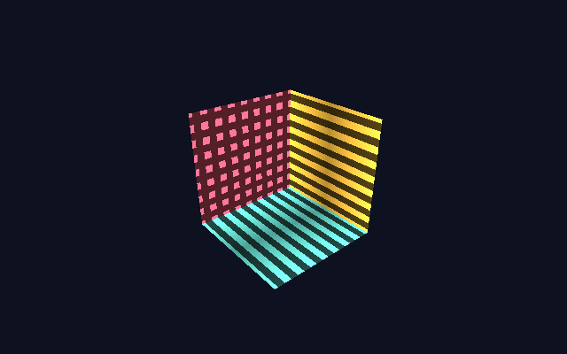

# Direct rendering: OpenGL ES 2 on the GPU

ntk can draw a window's contents on the GPU and hand the finished frame to
the X server as a buffer it already has — no pixels on the socket, no GL
commands on the socket, and a modern shader pipeline instead of a
fixed-function one.

This is the **direct** backend. The other one, [indirect
GLX](context-opengl.md), serializes GL commands into the X connection and is
what ntk has always used. They are different pipelines with different APIs,
and which one a window gets is [`glPolicy`](#glpolicy) — whose default is
still `indirect`, so nothing changes until you ask.



The pattern above is computed per fragment from the interpolated position —
the kind of thing the fixed-function pipeline has no way to express, and the
reason this backend exists.

```js
const app = await createClient({ glPolicy: 'auto' });

const config = await app.chooseGLConfig({ DEPTH_SIZE: 24 });
const wnd = app.createWindow({
  width: 640,
  height: 480,
  visual: config.visual,
  depth: config.depth,
  backingStore: false // GL draws the window itself; it needs no pixmap
});
wnd.on('expose', draw); // see "Draw on expose" below
wnd.map();

const gl = wnd.getContext('opengl', config);
await gl.ready; // the whole path is proven, or this rejects with a reason

function draw() {
  gl.makeCurrent();
  gl.viewport(0, 0, wnd.width, wnd.height);
  gl.clearColor(0.05, 0.06, 0.12, 1);
  gl.clear(gl.COLOR_BUFFER_BIT | gl.DEPTH_BUFFER_BIT);
  // ... shaders, buffers, draws ...
  gl.SwapBuffers();
}
```

## How it works

```
GPU (DRM render node)                     X server
---------------------                     --------
draw with GL ES 2 into a GBM buffer
swap()  ->  dma-buf fd  --- fd over the unix socket (DRI3) --->  pixmap
Present.Pixmap(window, pixmap)  --------- flip or copy, at a vblank
                     <----- PresentIdleNotify  (the buffer is ours again)
```

The descriptor is passed **once per buffer**. Every later frame drawn into
that buffer is a single `Present.Pixmap` request naming a pixmap the server
already holds, so a frame costs one request whatever its resolution — the
`test/gl-direct-live.test.js` case that counts imports at the protocol seam is
there to keep it that way.

Three pieces have to be in place, and all three are checked before anything is
created:

| piece | what it is | where it comes from |
| --- | --- | --- |
| `x11-dri` | the GPU context (GBM + EGL) and the dma-buf export | optional dependency, prebuilt for linux x64/arm64 |
| DRI3 | turns a dma-buf into a pixmap | the X server (Xorg + glamor, Xwayland) |
| Present | shows a pixmap, and says when its buffer is free | the X server |

`x11-dri` is a native addon, so ntk depends on it *optionally*: it is never
required to install or run ntk, nothing imports it until a policy asks for
direct rendering, and its absence is one of the reasons `direct` can be
false. Mesa's `libgbm`/`libEGL`/`libGLESv2` are `dlopen()`ed at run time, so
there is nothing to rebuild when they change.

## glPolicy

Set it on `createClient`, as a mode string or an object:

```js
createClient({ glPolicy: 'auto' });
createClient({ glPolicy: { mode: 'auto', maxInFlight: 3 } });
```

| mode | meaning |
| --- | --- |
| `'indirect'` | **default** — indirect GLX, the backend ntk has always used |
| `'auto'` | direct where it is available, indirect otherwise |
| `'direct'` | direct or nothing: `getContext` throws rather than quietly running a fixed-function pipeline instead |
| `'off'` | no GL at all |

The default is not `auto` because the two backends expose **different GL
APIs** (below), and switching one under an app that never asked would break
its draw code. Opt in per app, or per run:

```sh
NTK_GL_POLICY=direct npm start    # overrides whatever the app passed
```

The environment wins deliberately — its job is running one build both ways.

Object form knobs, over `DEFAULT_GL_POLICY`:

| key | default | meaning |
| --- | --- | --- |
| `mode` | `'indirect'` | as above |
| `devicePath` | `null` | which render node to draw on; `null` picks the first usable one |
| `maxInFlight` | `2` | presents outstanding before a frame waits for a buffer |
| `linearFallback` | `true` | retry a refused buffer once with a linear layout, which is what makes rendering on one GPU and displaying on another work |

## What is available, and why not

```js
const caps = await app.glCapabilities();
// { direct: true, indirect: true, device: '/dev/dri/renderD128', reason: null }
```

`reason` is an `Error` whose `code` is one of `GLError` — branch on the code,
not the message:

| code | meaning | remedy |
| --- | --- | --- |
| `GL_NO_ADDON` | `x11-dri` is not installed | `npm install x11-dri` |
| `GL_NO_DRIVER` | no `libgbm`/`libEGL`/`libGLESv2`, or not Linux | install Mesa; direct rendering is Linux-only |
| `GL_NO_DEVICE` | no readable `/dev/dri/renderD*` | map the device into the container, or join the `render` group |
| `GL_REMOTE_DISPLAY` | a TCP or forwarded display | direct rendering is local-only; use indirect over a network |
| `GL_NO_FD_PASSING` | local display, but this runtime cannot pass a descriptor | run under Node — Bun does not implement the internal x11 uses |
| `GL_NO_DRI3` | the server has no DRI3/Present | Xvfb, Xephyr and XQuartz have none |
| `GL_IMPORT_FAILED` | the server refused the buffer | usually different DRM devices — set `devicePath` |
| `GL_CONTEXT_FAILED` | GBM/EGL setup failed | the message says what did |
| `GL_DISABLED` | `glPolicy: 'off'` | — |

The probe runs during `createClient()` whenever the policy could choose
direct, which is what lets `getContext()` pick a backend synchronously
afterwards. Under the default policy it does not run at all, so an app that
never asked pays nothing for it — but it also means that raising the policy
*after* connecting needs one `await app.glCapabilities()` before a context can
be created.

### Runtimes

Direct rendering needs a runtime that can send a file descriptor over a unix
socket, because that is how DRI3 hands the server a buffer. `x11` does it
through Node's internal `process.binding('pipe_wrap')`, so:

| runtime | direct | indirect |
| --- | --- | --- |
| Node | yes | yes |
| Bun | **no** — `process.binding('pipe_wrap')` is not implemented | yes |

Under Bun the capability probe reports `GL_NO_FD_PASSING` and `'auto'` falls
back to indirect GLX, which needs no descriptor passing at all. Nothing else
about the display has to change.

## The API is not the GLX one

| | direct (`'gles'`) | indirect (`'opengl'`) |
| --- | --- | --- |
| pipeline | OpenGL ES 2.0 | OpenGL 1.x fixed-function |
| naming | `gl.clearColor`, `gl.drawArrays` | `gl.ClearColor`, `gl.Begin` |
| shaders | **yes**, GLSL ES 1.00 | none — the protocol encodes no shader objects |
| geometry | VBOs, `drawArrays`/`drawElements` | immediate mode + display lists |
| reach | local connections, Linux, a GPU | any server allowing indirect contexts |

Code that runs on either branches on `gl.backend`, which is `'direct'` or
`'indirect'`:

```js
if (gl.backend === 'direct') gl.clear(gl.COLOR_BUFFER_BIT);
else gl.Clear(gl.COLOR_BUFFER_BIT);
```

`getContext('opengl')` is the backend-neutral name and obeys the policy.
`getContext('gles')` asks for the direct one by name and throws if it is not
available — useful when the code only knows how to drive ES 2 anyway.

The ES 2 surface is whatever `x11-dri` exposes, which is the core of ES 2
(shaders, programs, uniforms, buffers, attributes, draws, `readPixels`) and
**not yet textures, framebuffer objects, blending or scissoring**. Adding an
entry point is a small wrapper in that package.

### Context lifetime

- **One GPU context per app and pixel format.** Programs, buffers and other
  GL objects are shared between surfaces on a connection, the way they are
  between canvases in a browser tab, and exactly one surface is current at a
  time.
- `gl.makeCurrent()` binds this context's surface and picks up a resize —
  call it at the top of every frame. Individual `gl.*` calls also bind if
  another surface stole currency, so a stray call cannot draw into the wrong
  window.
- `gl.destroy()` releases the surface, its pixmaps and its event selection.
  The shared GPU context belongs to the connection and is released by
  `app.close()`.

### Frames and back pressure

- `gl.SwapBuffers()` (or `gl.swapBuffers()`) shows the frame just drawn. It
  returns `false` when the frame could not go out because every buffer is
  still with the server.
- `gl.canRender()` is the same question asked before drawing, and
  `gl.onFrameAvailable = fn` fires when the answer becomes yes again. A draw
  loop that respects both never renders frames that have nowhere to go:

  ```js
  gl.onFrameAvailable = () => wnd.requestAnimationFrame(draw);

  function draw() {
    if (!gl.canRender()) return; // onFrameAvailable will call back
    // ... draw ...
    gl.SwapBuffers();
    wnd.requestAnimationFrame(draw);
  }
  ```

- Presents are sent with `targetMsc: 0` and no `Option.Copy`, so the server
  shows them at the next vblank and may flip rather than copy. Frame *pacing*
  is still the window's frame clock ([window.md](window.md)); the swap chain
  only bounds how many frames can be in flight.

### Draw on expose

A `Present` to a window that is not yet viewable is discarded — there is
nowhere to put it — so a frame drawn immediately after `map()` never appears,
and a window that gets uncovered has nothing to redraw itself from. A GL
window has no backing store to serve those from, which is why every GL app
draws on expose:

```js
wnd.on('expose', draw); // adding the listener is what selects Exposure
wnd.map();
```

## Choosing a window to draw into

`app.chooseGLConfig(spec)` answers for whichever backend the policy picked,
in GLX's attribute vocabulary either way, so the call site does not have to
be written twice:

```js
const config = await app.chooseGLConfig({ DEPTH_SIZE: 24 });
// { backend: 'direct', visual, depth, class, doubleBuffer, depthSize,
//   screen, fbconfig: null, device, config: {} }
```

On the direct backend it needs no round trip — there are no fbconfigs, only a
window whose depth the GPU's buffers can be read as. `DEPTH_SIZE` becomes the
EGL depth-buffer size; `ALPHA_SIZE` picks a 32-bit ARGB visual (whose alpha a
compositor blends) instead of the root's 24-bit one. Everything else in the
spec is ignored there, and honoured by
[`chooseGLXConfig`](context-opengl.md#choosing-a-visual) on the indirect one.

## Testing

`test/gl-policy.test.js` covers the decisions — policy resolution, the client
probe, capability gating, error codes — hermetically, with the addon stubbed,
so it runs with no display and no GPU. `test/gl-direct-live.test.js` renders a
shader-drawn triangle and reads the window back with `GetImage`; it skips
wherever the path is unavailable, which includes CI (Xvfb has no DRI3).
