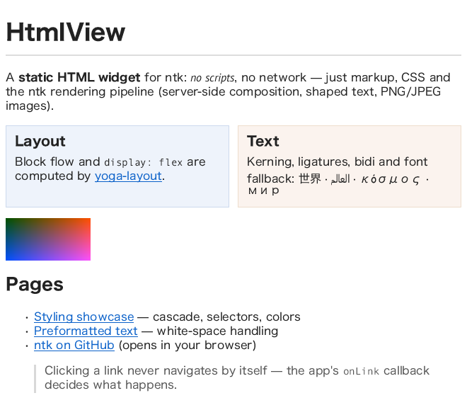

# HTML widget (HtmlView)

`HtmlView` renders a **static subset of HTML + CSS** into a window (or any
2d-context target). There is no scripting and no network access: documents
are strings you pass in, and resources (images) resolve only through an
explicit allow-path.



```js
import { createClient, HtmlView } from 'ntk';

const app = await createClient();
const wnd = app.createWindow({ width: 640, height: 480, title: 'html' });
const view = new HtmlView(wnd, {
  onLink: (href, event, element) => console.log('clicked', href)
});
view.setHtml(`
  <h1>Hello</h1>
  <p>Some <b>markup</b>, a <a href="next.html">link</a> and CSS:</p>
  <div style="display: flex; gap: 10px">
    <div style="flex: 1; background: #eef">left</div>
    <div style="flex: 2; background: #fee">right</div>
  </div>
`);
wnd.map();
```

Layout is hybrid: block flow and flexbox boxes are computed by
[yoga-layout](https://www.npmjs.com/package/yoga-layout) (pure WASM, no
native modules); inline runs are shaped and wrapped by the ntk text pipeline
([TextLayout](text.md)) — kerning, bidi, font fallback all apply. Parsing
uses [htmlparser2](https://www.npmjs.com/package/htmlparser2), selector
matching [css-select](https://www.npmjs.com/package/css-select), stylesheet
parsing [postcss](https://www.npmjs.com/package/postcss). PNG/JPEG images
render through the [image pipeline](images.md); SVG — inline or as an
`` source — through the [SVG widget](svg.md).

The yoga-layout instance ntk uses is re-exported as `Yoga`
(`import { Yoga } from 'ntk'`) so downstream layout consumers — e.g. the
react-x11 renderer — share the same WASM module and enum values instead of
loading a second, possibly version-mismatched copy.

The two value parsers the CSS layer is built on are exported for the same
reason: `cssColor(value)` → **premultiplied** `[r, g, b, a]` floats 0..1
(what XRender and GL both want — see
[context-2d.md](context-2d.md#color)) or `null`, and
`cssLength(value, emBase, rootSize)` → `{ px }`, `{ pct }`, `'auto'` or
`null`.

## The safety / responsibility model

The API is deliberately split so that a document can never act on its own:

- **The app owns navigation.** Clicking a link only calls `onLink(href,
  event, element)`. The widget never fetches or replaces documents; if you
  want navigation, call `setHtml()` yourself with whatever the link should
  mean (see `examples/html.js`).
- **No network, no scripts.** `<script>` (and other active/embedded content:
  iframes, media, forms) is ignored. `data:` image URIs always work; any
  other image source loads **only** if you opt in:
  - pass `baseUrl` — relative `src` then resolves against it, restricted to
    local `file:` reads, or
  - pass a `loadResource(url, { element })` hook and implement any policy
    you like (return a `Buffer` of encoded bytes, an `Image`, or `null`).
  - pass `loadResource: null` to disable everything except `data:` URIs.
- Malformed HTML/CSS never throws — unparseable constructs are skipped.

## Constructor

```js
new HtmlView(window, {
  theme,            // { family, size, color, background } base look
  stylesheet,       // string | string[] — extra author CSS (after <style>s)
  onLink,           // (href, event, element) => void
  onInvalidate,     // () => void — async content (an image) arrived
  baseUrl,          // path / file URL for relative image src resolution
  loadResource,     // custom resource loader, or null to disable
  fonts             // FontManager — only for windowless (standalone) use
})
```

In window mode the widget wires itself: renders on `expose`, re-wraps on
`resize`, scrolls with the wheel (X11 buttons 4/5), fires `onLink` on left
click. Standalone mode mirrors `MarkdownView`: pass `null` for the window
plus a `fonts` manager, then drive `layout()`/`draw()` yourself; pass
`onInvalidate` to re-layout/redraw when async content (an image) arrives —
window mode repaints on its own.

## Methods

- `setHtml(html, { baseUrl })` — parse and adopt a document (full documents
  or fragments; `<style>` elements are honored). Replaces the previous one,
  resets scroll, frees old resources.
- `layout(width)` → content height — lay out for a container width
- `draw(ctx, x, y)` — draw the last layout onto any 2d context
- `render()` — window mode: full clear + layout-if-needed + draw
- `linkAt(x, y)` → `{ href, element }` | null — link hit test (coordinates
  of the last draw)
- `elementAt(x, y)` → DOM element | null — deepest element at a point
  (htmlparser2 node: `.name`, `.attribs`, `.children`, `.parent`)
- `scrollBy(dy)` / `scrollTo(y)` — window mode scrolling, clamped
- `contentHeight` — after layout
- `destroy()` / `Symbol.dispose` — free yoga nodes and image uploads

## Supported HTML

- structure: `html body div section article header footer nav aside main
  figure figcaption blockquote p h1–h6 hr br`
- text: `span a b strong i em u s strike del ins code kbd samp tt pre big
  small sub sup center` (sub/sup render as smaller text, no baseline shift)
- lists: `ul ol li dl dt dd` with `disc circle square decimal
  lower/upper-alpha` markers
- tables: `table thead tbody tfoot tr td th` — approximated as flex rows
  with equal-width cells (no content-based column sizing)
- images: `img` with `src` (PNG/JPEG/SVG), `width`/`height` attributes,
  `alt` placeholder text while loading / on failure. SVG sources are
  detected by content sniffing (any of: file bytes, a `loadResource`
  buffer, `data:image/svg+xml` URIs — base64 or percent-encoded) and
  rendered as vectors via [SvgView](svg.md)
- inline `<svg>`: a replaced element, laid out like an image — intrinsic
  size from `width`/`height`/`viewBox` (ratio-preserving shrink to the
  container), rendered by [SvgView](svg.md) with its supported subset;
  adopted synchronously, so sizing is right on the first layout pass
- dropped: `head style script title meta link template noscript iframe
  object embed audio video canvas input select textarea button`

## Supported CSS

Selectors: everything css-select supports — type/class/id, descendant,
`>`, `+`, `~`, attributes, `:first-child`-style pseudo-classes. Cascade
uses standard specificity plus source order, `!important`, inline `style`
last; inheritance for text properties. `@media` blocks apply only when the
query is a bare `screen`/`all` (conditions are not evaluated).

| Group | Properties |
|---|---|
| box | `display` (`block inline inline-block flex list-item none`), `width height min/max-*`, `margin*` (incl. `auto`), `padding*`, `border*` (solid, per-side widths/colors), `box-sizing` is always border-box |
| flex | `flex-direction flex-wrap justify-content align-items align-self flex-grow flex-shrink flex-basis flex gap row-gap column-gap` |
| text | `color font-family font-size font-weight font-style line-height text-align text-decoration white-space` (`normal pre nowrap`) `list-style-type` |
| background | `background-color` (and the color of a `background` shorthand) |

Units: `px pt em rem %` and font-size keywords. Colors: named, `rgb[a]()`,
`hsl[a]()`, `transparent`, and hex in all four lengths including alpha
(`#rgb`, `#rgba`, `#rrggbb`, `#rrggbbaa`).

Not supported (silently ignored): floats, absolute/relative positioning,
grid, background images, border-radius, shadows, transforms, transitions,
generated content, tables' real column algorithm, inline images mid-text
(an `` always becomes its own box, breaking the surrounding inline
run). Adjacent sibling margins collapse (the common case); parent/child
margin collapsing is not performed.

## Theming

`theme` sets the root defaults — `family`, `size` (root `rem` base),
`color`, `background` (the window clear color). Everything else is CSS:
pass app-level rules via `stylesheet`, they cascade after document
`<style>`s at equal specificity.

```js
const view = new HtmlView(wnd, {
  theme: { size: 15, background: '#fbfbf8' },
  stylesheet: 'a { color: #7a2048 } h1 { border-bottom: 1px solid #ddd }'
});
```

## Images and relayout

Image loading is asynchronous. Boxes with `width`/`height` (attributes or
CSS) reserve space immediately; unsized images occupy 0×0 until decoded,
then the widget invalidates layout and re-renders automatically (window
mode). Decoded images upload to the X server once and are freed on
`setHtml`/`destroy`. Inline `<svg>` needs no loading at all; `` SVG
sources go through the same asynchronous resolution as rasters but hold no
server-side resources (they redraw as vectors).
