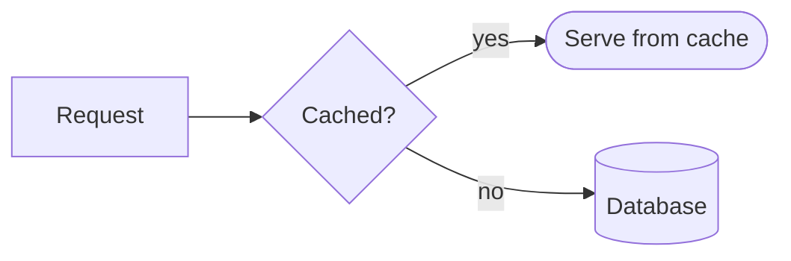

# Mermaid diagrams

MarkdownView renders ```` ```mermaid ```` fences as diagrams. Parsing uses
the [mermaid](https://www.npmjs.com/package/mermaid) package's own grammar
— imported lazily and run headless (mermaid's *renderer* is the only part
that needs a browser, so ntk draws natively instead): flowcharts are laid
out by [@dagrejs/dagre](https://www.npmjs.com/package/@dagrejs/dagre) and
sequence diagrams by a classic column/row pass, with text measured by the
ntk font pipeline and everything composited server-side through the
[2d context](context-2d.md).

````markdown

````

See `examples/mermaid.js` for a full tour.

## Supported diagrams

- **flowchart / graph** — all directions (`TB`/`TD`/`BT`/`LR`/`RL`); node
  shapes: rect, round, stadium, subroutine, cylinder, circle, diamond,
  hexagon (other shapes draw as rects); solid/dotted/thick edges with
  labels, chains (`A --> B --> C`) and `&` fans
- **sequenceDiagram** — `participant`/`actor` with `as` aliases; arrows
  `->`, `-->`, `->>`, `-->>`, `-x`, `--x`, `-)`, `--)`; `Note left
  of`/`right of`/`over A,B`; `loop`/`opt`/`alt`/`else`/`par`/`and`/
  `critical`/`break` frames; `autonumber`; self-messages

Any other diagram type (gantt, pie, class, state, …) parses but has no
native renderer: the fence falls back to a plain code block — the same
contract as invalid ```` ```math ```` fences.

## Behavior

- **Async**: the mermaid grammar loads on the first fence (hundreds of ms);
  fences render as code blocks until parsing resolves, then the view
  invalidates and re-renders automatically (window mode). Standalone users:
  lay out again after a tick, as with HtmlView images.
- **Fit**: diagrams wider than the content width are laid out again at a
  proportionally smaller font (floor 8px), then centered.
- **Theme**: node/actor fills follow mermaid's default palette; label
  knock-out backgrounds use the markdown theme's `background`, text uses
  the theme `color`.

## Direct API

```js
import { parseMermaid, layoutMermaid } from 'ntk/lib/widgets/mermaid.js';

const model = await parseMermaid('flowchart LR\n A --> B'); // throws if unsupported
const box = layoutMermaid(model, { fonts: app.fonts, size: 13, maxWidth: 600 });
box.draw(ctx, x, y); // box.width / box.height / box.type / box.warnings
```

## Headless mermaid, for the curious

The mermaid package only touches the DOM in two places that matter here:
DOMPurify label sanitization (shimmed to the identity — labels are drawn
as text, never injected into any DOM) and the SVG renderer (unused; ntk
draws diagrams itself). Everything else — the grammar, the diagram
databases — runs fine in Node.
