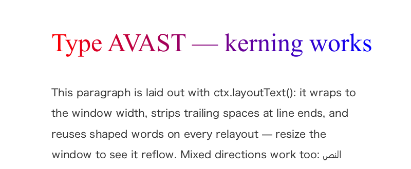
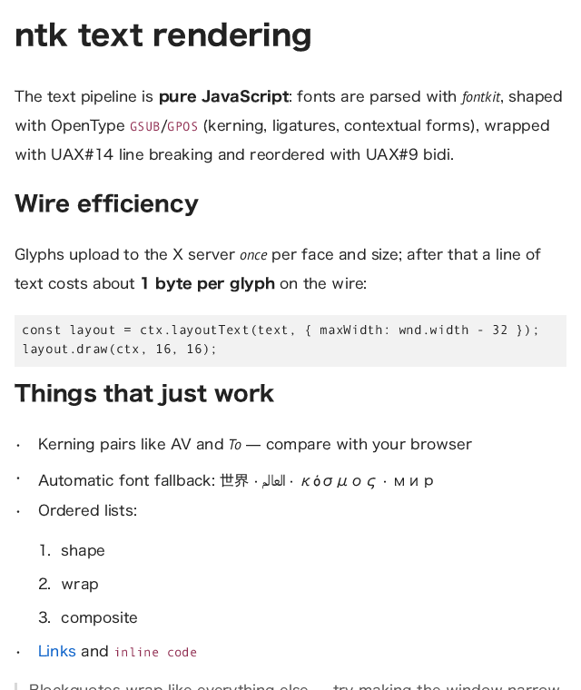

# Text: shaping, layout and the markdown widget

The text stack is pure JavaScript end to end and is designed around one
goal: **correct, fully shaped text with the least possible traffic to the
X server**.

```
lib/text/font.js         Font: one parsed face — metrics, coverage, shaping,
                         glyph rasterization (fontkit)
lib/text/fontmanager.js  FontManager (`app.fonts`): matching, custom fonts,
                         per-codepoint fallback, shaping/layout entry points
lib/text/shape.js        bidi (UAX#9) → font itemization → OpenType shaping
lib/text/layout.js       TextLayout: UAX#14 line breaking, wrapping, alignment
lib/text/glyphs.js       server glyph cache + CompositeGlyphs encoder
lib/widgets/markdown.js  markdown parsing (adapter over `marked`)
lib/widgets/markdownview.js  MarkdownView widget
```

## Quick start

```js
const ctx = wnd.getContext('2d');

// canvas-style: shaped automatically (kerning, ligatures, bidi, fallback)
ctx.font = '20px "DejaVu Sans", sans-serif';
ctx.fillText('The quick brown fox — الثعلب البني السريع — 素早い茶色の狐', 16, 40);

// layout extension: wrap to a container width without drawing
const layout = ctx.layoutText(longText, { maxWidth: wnd.width - 32, lineHeight: 1.35 });
console.log(layout.lines.length, layout.height);
layout.draw(ctx, 16, 60);
```



## The pipeline

1. **Match** — `app.fonts.match(family, { weight, style })` resolves CSS-ish
   patterns to font files via the `fc-match` CLI (present on any system with
   X11). Comma-separated family lists work natively. Fonts registered with
   `app.fonts.load(path)` take priority. `.ttc` collections are supported
   (faces are selected by postscript name).
2. **Bidi** — [bidi-js](https://www.npmjs.com/package/bidi-js) computes
   UAX#9 embedding levels; text splits into direction runs.
3. **Itemize** — each direction run splits again wherever the primary font
   lacks a glyph: `app.fonts.fallbackFor(codepoint)` walks the fontconfig
   fallback chain (using fontconfig's own coverage data, so candidate files
   are only opened to confirm) and picks the best font that covers the
   character. The primary font always wins when it covers a char, keeping
   fallback runs minimal.
4. **Shape** — [fontkit](https://www.npmjs.com/package/fontkit) applies
   OpenType GSUB/GPOS: kerning, ligatures, contextual forms for complex
   scripts (Arabic joining etc.). RTL runs come back in visual order.
5. **Rasterize + upload** — new glyphs are rasterized by the built-in
   scanline rasterizer (`lib/rasterize.js`) and uploaded once per
   (face, size) with a single batched `AddGlyphs` request. (Above 96px the
   supersampling drops from 4×4 to 2×2 — indistinguishable at that size and
   4× cheaper.)
6. **Composite** — drawing sends one `CompositeGlyphs` request; the server
   does all the actual blending.

Very large or continuously animated sizes take a different route — see
[the vector text path](#the-vector-trapezoid-text-path) below.

## Wire efficiency

XRender glyph ids are client-assigned, and ntk exploits that:

- Glyphs get **compact sequential ids** (0, 1, 2, …) per glyphset, so the
  8-bit `CompositeGlyphs8` encoding (1 byte per glyph) applies until a
  face/size has uploaded more than 256 distinct glyphs, and 16-bit after
  that. Font glyph indices (which would force 32-bit) never hit the wire.
- Each glyph's rounded advance is **baked into the glyph** at upload, so the
  server moves the pen itself. Position data is emitted only when the shaped
  position deviates from the server pen: at run starts, kern pairs, mark
  offsets and rounding-drift corrections. A line of plain text costs one
  8-byte elt header plus 1 byte per glyph.
- Mixed faces/sizes in one draw (font fallback, styled spans) use in-request
  **glyphset switch** entries (12 bytes) instead of separate requests.
- Uploaded bitmaps are cached per app connection (`app._glyphPages`) and
  shared by every window and pixmap; re-drawing text costs no uploads. The
  cache is LRU-bounded (default 8MB of uploaded bitmap bytes): when the
  budget is exceeded, the least-recently-drawn (face, size) page is freed
  server-side with `FreeGlyphSet`, so transient sizes don't accumulate.
- `TextLayout` memoizes shaping per word, so re-wrapping on window resize
  re-uses shaped glyphs and sends only composition requests.

For scale: a 60-character line of 16px Latin text is ~70 bytes of
`CompositeGlyphs` after warm-up. The one-time glyph upload for a full
Latin face at 16px is a few kilobytes.

## The vector (trapezoid) text path

Bitmap glyph uploads scale with size² while outline complexity scales with
roughly √size: measured on a serif face, the wire-size crossover is at
≈96–128px for Latin and ≈130–190px for dense CJK, and at 256px a full Latin
set costs ~2.4MB of server-side cache per face. Uploads amortize for text
that is drawn repeatedly — but never for *continuously animated* sizes
(zoom/pinch), where every frame is a new (face, size) page.

So `drawGlyphRuns` routes each run (issue #45):

- **size ≤ 128px** — cached bitmap glyphs, unconditionally (status quo);
- **size > 256px** — trapezoids by default: the glyph outline is flattened
  at the exact size, decomposed into trapezoids (`lib/trapezoid.js`) and
  rendered server-side with one batched `AddTraps` + `Composite` through a
  shared scratch a8 mask per draw. Nothing is cached server-side;
- **in between** — bitmaps, unless the size is fractional or a small
  per-face ring of recently drawn sizes shows no reuse (an animation in
  flight). Both signals route to vector, and an animation that settles
  flips back to bitmaps on the next frame.

Vector-path positioning is *not* rounded to whole pixels, so fractional
sizes and fractional pen positions animate smoothly (the bitmap path rounds
both, which is correct for static UI text).

The thresholds and the cache budget are per-app configurable:

```js
app.textPolicy = {
  bitmapMax: 128,        // ≤ this: always bitmaps
  vectorFrom: 256,       // > this: always trapezoids (Infinity to opt out)
  cacheBytes: 8 << 20    // LRU budget for uploaded glyph bitmaps
};
```

Partial objects are fine — unset keys keep their defaults
(`DEFAULT_TEXT_POLICY` in `lib/text/glyphs.js`).

## API

### `app.fonts` → FontManager

- `match(family, { weight, style })` → `Font` — fontconfig resolution with
  registered fonts first. `family` may be a comma-separated list.
- `load(path, { postscriptName, family, weight, style })` → `Font` —
  register a font file (bundled/custom fonts; issue-16-style usage):

  ```js
  app.fonts.load('./assets/Inter.ttf');
  ctx.font = '16px Inter';
  ```

- `fallbackFor(codepoint, family, opts)` → `Font | null`
- `shape(text, style)` → shaped runs (see below)
- `layout(content, style, options)` → `TextLayout`

`FontManager` is exported from the package root and works without an X
connection — measurement and layout are fully headless.

### `Font`

`familyName`, `postscriptName`, `unitsPerEm`, `metrics(size)` →
`{ ascent, descent, lineGap, lineHeight, capHeight, xHeight }` (px,
descent positive-down), `hasGlyph(cp)`, `shape(text, size, opts)`,
`rasterize(glyphId, size)`.

### Shaping

```js
const shaped = app.fonts.shape('عالم hello', { family: 'sans-serif', size: 24 });
// { text, width, baseLevel, runs: [ { font, size, direction, level, width,
//     glyphs: [{ id, ax, dx, dy, codePoints }], text } ] }  (logical order)
```

`reorderRuns(runs)` (from `lib/text/shape.js`) gives visual order.
`style.features` passes OpenType feature tags through to fontkit
(e.g. `['smcp']`); `style.direction` forces the paragraph direction.

### `TextLayout`

```js
const layout = app.fonts.layout(content, style, {
  maxWidth: 400,      // target container width (the requested extension)
  align: 'start',     // left | right | center | start | end
  lineHeight: 1.35,   // multiplier over natural font line height
  direction: 'auto'   // base paragraph direction
});
```

`content` is a string or styled spans:

```js
app.fonts.layout([
  { text: 'warning: ', weight: 700, color: 'red' },
  { text: 'something happened' }
], { family: 'sans-serif', size: 16 }, { maxWidth: 300 });
```

Results are inspectable before drawing: `layout.width`, `layout.height`,
`layout.lines[] = { x, y, baseline, width, ascent, descent, runs }` where
`runs[] = { x, width, run, span }` in visual order. `layout.draw(ctx, x, y)`
draws, batching consecutive same-color runs into single requests.

Line breaking is UAX#14 (`linebreak` package); `\n` forces breaks; a word
wider than `maxWidth` force-breaks at the widest cluster prefix that fits;
trailing whitespace at line ends is stripped (and doesn't count against
`maxWidth` during fitting, CSS-style).

### 2d context

- `ctx.font` — CSS shorthand; `ctx.textAlign`, `ctx.textBaseline`
- `ctx.fillText(text, x, y)` / `ctx.measureText(text)` (canvas-style
  TextMetrics: `width`, `actualBoundingBox*`, `fontBoundingBox*`)
- `ctx.layoutText(content, options)` → `TextLayout` with the current
  `ctx.font` as base style

### `MarkdownView`

```js
import { createClient, MarkdownView } from 'ntk';
const view = new MarkdownView(wnd, { theme: { size: 15, linkColor: '#0b61c9' } });
view.setMarkdown('# Hello\n\nSome *markdown*.');
wnd.map(); // renders on expose, re-wraps on resize
```

Parsing is CommonMark + GFM via [marked](https://marked.js.org). Rendered
blocks: headings, paragraphs, fenced code, blockquotes, nested
ordered/unordered lists, `---` rules (tables fall back to their monospaced
source for now). Inlines: `**strong**`, `*em*`, `` `code` `` (with
background), `[links](url)` (colored + underlined); images render as links
to their source.
All layout — wrapping, font selection per style, spacing — runs through
`TextLayout`; drawing batches glyphs per color.

Fenced code blocks are **syntax highlighted** through
[highlight.js](https://highlightjs.org) (the `common` build: ~36 languages
plus their aliases — `js`/`ts`, `json`, `python`, `shell`, `c`/`cpp`,
`java`, `go`, `rust`, `css`, `sql`, `html`/`xml`, …), adapted to flat
tokens by `lib/widgets/highlight.js` (exported as `highlightCode`).
Unknown tags render plain. Colors come from `theme.codeTheme`, a map from
token kind (`keyword`, `literal`, `string`, `number`, `comment`, `tag`,
`attr`, `function`) to color — partial overrides merge with the defaults.

Fences tagged `math`, `tex`, `latex` or `katex` render as **display-mode
formulas** via KaTeX (centered, at 1.21× the base size like katex.css);
a formula that fails to parse falls back to a plain code block. See
[tex.md](tex.md).

Links are clickable. Every `draw()` records the device-space rectangles of
rendered links; `view.linkAt(x, y)` returns the href under a point (or
null). In window mode a left-button `mousedown` is resolved automatically
and forwarded to `view.onLink(href, event)` — set it via the `onLink`
constructor option or assign the property; standalone embedders call
`linkAt` from their own event handlers. Navigation semantics (opening
files, browsers, history) are the embedder's job —
[examples/markdown.js](../examples/markdown.js) is a small documentation
browser built this way.

Headless/embedded use: `new MarkdownView(null, { fonts })`, then
`view.layout(width)` → content height, `view.draw(ctx, x, y)`.

`TextLayout` note for widget authors: spans keep unknown fields through
layout normalization, and line runs expose their span (`run.span`), so
markers attached to spans (like MarkdownView's `_href`) can be read back
per positioned run after layout.



## Design notes: revisiting the old issues (2015–2018)

The text issues in the tracker predate this stack; here is how they
resolved in 2026:

- **#12 harfbuzz, #35 fontkit-as-substitute** — fontkit's layout engine
  (a JS port of harfbuzz's shapers, including the universal shaping engine)
  is used for all shaping. It is pure JS — no native module, no WASM blob —
  and handles kerning, ligatures and Arabic-class contextual shaping. For
  the most demanding Indic edge cases harfbuzz remains the gold standard;
  if that gap ever matters, `harfbuzzjs` (WASM) can slot in behind the same
  `Font.shape()` interface.
- **#13 fribidi** — replaced by `bidi-js`, a pure-JS UAX#9 implementation.
  No native dependency needed.
- **#11 char coverage / #18 substituteFont** — both asked for
  `font-manager` (a native module). Solved instead with fontconfig's CLI:
  `fc-match -s --format '%{file}\t%{postscriptname}\t%{charset}\n'` returns
  the whole fallback chain *with coverage data* in one ~50ms call (cached).
  `fontkit.hasGlyphForCodePoint` confirms before use.
- **#16 custom fonts api** — `app.fonts.load(path)`, mirroring
  node-canvas's `registerFont`.
- **#14/#25/#34 vector outlines for large sizes** — superseded by **#45**,
  which replaced the old premise with measured crossovers and is now
  implemented: bitmaps stay the default where reuse amortizes uploads
  (≤128px, and any size that repeats), trapezoids take over for very large
  and continuously animated sizes. See
  [the vector text path](#the-vector-trapezoid-text-path).

x11 dependency: already at the latest published release (2.3.0).
