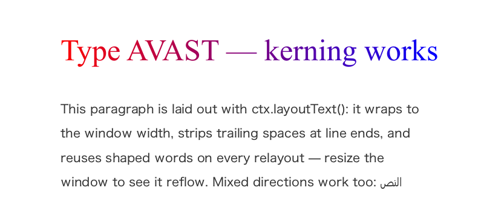

# Text: shaping and layout

The text stack is pure JavaScript end to end and is designed around one
goal: **correct, fully shaped text with the least possible traffic to the
X server**.

```
lib/text/font.js         Font: one parsed face — metrics, coverage, shaping,
                         glyph rasterization (fontkit)
lib/text/fontmanager.js  FontManager (`app.fonts`): matching, custom fonts,
                         per-codepoint fallback, shaping/layout entry points
lib/text/shape.js        bidi (UAX#9) → font itemization → OpenType shaping
lib/text/layout.js       TextLayout: UAX#14 line breaking, wrapping, alignment
lib/text/glyphs.js       server glyph cache + CompositeGlyphs encoder
```

## Quick start

```js
const ctx = wnd.getContext('2d');

// canvas-style: shaped automatically (kerning, ligatures, bidi, fallback)
ctx.font = '20px "DejaVu Sans", sans-serif';
ctx.fillText('The quick brown fox — الثعلب البني السريع — 素早い茶色の狐', 16, 40);

// layout extension: wrap to a container width without drawing
const layout = ctx.layoutText(longText, { maxWidth: wnd.width - 32, lineHeight: 1.35 });
console.log(layout.lines.length, layout.height);
layout.draw(ctx, 16, 60);
```



## The pipeline

1. **Match** — `app.fonts.match(family, { weight, style })` resolves CSS-ish
   patterns to font files via the `fc-match` CLI (present on any system with
   X11). Comma-separated family lists work natively. Fonts registered with
   `app.fonts.load(path)` take priority. `.ttc` collections are supported
   (faces are selected by postscript name).
2. **Bidi** — [bidi-js](https://www.npmjs.com/package/bidi-js) computes
   UAX#9 embedding levels; text splits into direction runs.
3. **Itemize** — each direction run splits again wherever the primary font
   lacks a glyph: `app.fonts.fallbackFor(codepoint)` walks the fontconfig
   fallback chain (using fontconfig's own coverage data, so candidate files
   are only opened to confirm) and picks the best font that covers the
   character. The primary font always wins when it covers a char, keeping
   fallback runs minimal. A face fontkit can make no glyph from covers
   nothing (`Font.drawable`): a bitmap-only colour emoji font (`CBDT`/`CBLC`,
   as Noto Color Emoji and EmojiOne ship on most Linux desktops) is passed
   by for the next face that has the character, and where none has it the
   character draws as the missing glyph. It used to be chosen, and the
   shaper threw on its null glyph.
4. **Shape** — [fontkit](https://www.npmjs.com/package/fontkit) applies
   OpenType GSUB/GPOS: kerning, ligatures, contextual forms for complex
   scripts (Arabic joining etc.). RTL runs come back in visual order.
5. **Rasterize + upload** — new glyphs are rasterized by the built-in
   scanline rasterizer (`lib/rasterize.js`) and uploaded once per
   (face, size) with a single batched `AddGlyphs` request. Coverage is
   computed by signed-area accumulation, so antialiasing is exact at every
   size and costs the same.
6. **Composite** — drawing sends one `CompositeGlyphs` request; the server
   does all the actual blending.

Very large or continuously animated sizes take a different route — see
[the vector text path](#the-vector-trapezoid-text-path) below.

## Wire efficiency

XRender glyph ids are client-assigned, and ntk exploits that:

- Glyphs get **compact sequential ids** (0, 1, 2, …) per glyphset, so the
  8-bit `CompositeGlyphs8` encoding (1 byte per glyph) applies until a
  face/size has uploaded more than 256 distinct glyphs, and 16-bit after
  that. Font glyph indices (which would force 32-bit) never hit the wire.
- Each glyph's rounded advance is **baked into the glyph** at upload, so the
  server moves the pen itself. Position data is emitted only when the shaped
  position deviates from the server pen: at run starts, kern pairs, mark
  offsets and rounding-drift corrections. A line of plain text costs one
  8-byte elt header plus 1 byte per glyph.
- Mixed faces/sizes in one draw (font fallback, styled spans) use in-request
  **glyphset switch** entries (12 bytes) instead of separate requests.
- Uploaded bitmaps are cached per app connection (`app._glyphPages`) and
  shared by every window and pixmap; re-drawing text costs no uploads. The
  cache is LRU-bounded (default 8MB of uploaded bitmap bytes): when the
  budget is exceeded, the least-recently-drawn (face, size) page is freed
  server-side with `FreeGlyphSet`, so transient sizes don't accumulate.
- `TextLayout` memoizes shaping per word, so re-wrapping on window resize
  re-uses shaped glyphs and sends only composition requests. `ctx.fillText`
  draws through the same memo, so repainting a label shapes it once, not
  once per frame. The memo is LRU-bounded (4000 entries): on overflow the
  least-recently-used half is dropped, so what is on screen stays shaped.
- A paragraph's layout up to the line fill is kept as well: its spans with
  their faces resolved, its bidi levels, and its text cut into shaped UAX#14
  tokens. None of that depends on the width, so a layout of the same
  paragraph at another width — every step of a window resize — starts at
  the line fill. A paragraph is found by its text and direction, and by
  every field of its spans and base style, compared against copies of the
  ones it was made from (`lib/text/paragraphs.js`); two generations of 512K
  characters are kept, and `fonts.load()` drops them, since a kept span
  holds the face its family matched before. Resizing a 600 KB HTML
  document laid out at 42 ms a frame instead of 86. Text under 64
  characters is never kept: a label is cheap to prepare and seldom laid out
  at a second width, and keeping it cost a UI's labels a quarter of their
  layout time. What is kept costs about 60 bytes of heap a character — 36
  MB for that 600 KB document, nothing for a UI's labels.
- A layout asked for its first lines (`maxLines`) of a paragraph nobody has
  prepared prepares the start of it, and lays the lines out from that,
  where every line kept is decided before the start ends: two lines past
  the last kept one are filled before the start is trusted, and a start
  that falls short is made four times longer, up to the whole. The start is
  kept like a paragraph, for the next layout of the same text to fill or to
  prepare further; a layout of the whole paragraph prepares it whole and
  keeps that instead. Only text nothing can make right-to-left is cut, so
  its levels are 0 wherever the cut falls. A paragraph laid out a line at a
  time beside a float — the rest of it, one line of it, as an HTML renderer
  does — prepared the whole rest at each line, the paragraph's square; a
  thirty-sentence paragraph so laid out with nothing kept took 3.7 ms, and
  takes 1.0.

For scale: a 60-character line of 16px Latin text is ~70 bytes of
`CompositeGlyphs` after warm-up. The one-time glyph upload for a full
Latin face at 16px is a few kilobytes.

And that one-time upload is shared across *processes*: ntk apps on one
display keep a common glyph cache through a `_NTK_GLYPHD` directory, so
the n-th app drawing an already-shared face skips the rasterization and
the upload entirely — see [shared-glyphs.md](shared-glyphs.md) for the
design, the protocol and the `NTK_NO_SHARED_GLYPHS` kill switch.

## The vector (trapezoid) text path

Bitmap glyph uploads scale with size² while outline complexity scales with
roughly √size: measured on a serif face, the wire-size crossover is at
≈96–128px for Latin and ≈130–190px for dense CJK, and at 256px a full Latin
set costs ~2.4MB of server-side cache per face. Uploads amortize for text
that is drawn repeatedly — but never for *continuously animated* sizes
(zoom/pinch), where every frame is a new (face, size) page.

So `drawGlyphRuns` routes each run (issue #45):

- **size ≤ 128px** — cached bitmap glyphs, unconditionally (status quo);
- **size > 256px** — trapezoids by default: the glyph outline is flattened
  at the exact size, decomposed into trapezoids (`lib/trapezoid.js`) and
  rendered server-side with one batched `AddTraps` + `Composite` through a
  shared scratch a8 mask per draw. Nothing is cached server-side;
- **in between** — bitmaps, unless the size is fractional or a small ring of
  what the face has drawn recently shows no reuse (an animation in flight).
  Both signals route to vector, and an animation that settles flips back to
  bitmaps on the next frame.

The ring is keyed by **face** and records the `(instance, size)` pairs a
glyph page is keyed by, which is what has to repeat for caching to pay for
itself. For a variable font the face is the one the instances were cut from,
not the instances: every point on an axis is a `Font` of its own, so an
animated axis would otherwise hand the router a fresh empty ring on every
step — eight unrelated faces each drawn once, no churn to see — and stay on
the bitmap path allocating a glyph page per step. A sweep of the `wght` axis
and a sweep of the size are the same event, and read as one.

Vector-path positioning is *not* rounded to whole pixels, so fractional
sizes and fractional pen positions animate smoothly (the bitmap path rounds
both, which is correct for static UI text).

### `textRendering`

Size is a guess at intent, and a good one for UI text. It cannot know that a
word is a headline whose weight is under a slider. `textRendering` is how a
run says so, taking CSS's property and its values:

```js
ctx.textRendering = 'geometricPrecision';
app.fonts.layout(spans, { family: 'Inter', size: 96, textRendering: 'geometricPrecision' });
```

| value                | route              |                                                     |
| -------------------- | ------------------ | --------------------------------------------------- |
| `auto` (default)     | thresholds decide  | today's behaviour                                   |
| `geometricPrecision` | always vector      | exact glyph origins, nothing cached                 |
| `optimizeSpeed`      | always bitmap      | cached glyphs at any size                           |
| `optimizeLegibility` | thresholds decide  | accepted, means `auto` — ntk has no hinting to turn on |

**Why display text wants `geometricPrecision`.** On the bitmap path a glyph
origin rounds to a whole pixel, because a cached bitmap can only land on
one, and each glyph's advance is baked into the glyphset as an integer. Slide
a variable font's `wght` and the true advances move by hundredths of a pixel;
those hundredths accumulate along the line until one glyph crosses a rounding
boundary and jumps a whole pixel on its own while its neighbours stand still.
Same font, same size, only the pen origin sliding by a tenth of a pixel:

```
bitmap   ink centroid over an 0.1px sweep:  6 distinct positions in 11 samples
vector   ink centroid over the same sweep: 11 distinct positions in 11 samples
```

It is a **per-span** property, so one paragraph can hold a headline that
wants exact positions and body text that wants its glyph cache — the two are
partitioned into separate composites, which is what already happens when a
paragraph crosses a size threshold.

The cost is real and worth stating: the vector path rasterizes outlines on
every draw and caches nothing. That is the right trade for text being
animated, and the wrong one for a paragraph that never changes.

`textPolicy.textRendering` sets an app-wide default for a window that is all
display text; a run that names its own always wins.

The thresholds and the cache budget are per-app configurable:

```js
app.textPolicy = {
  bitmapMax: 128,        // ≤ this: always bitmaps
  vectorFrom: 256,       // > this: always trapezoids (Infinity to opt out)
  cacheBytes: 8 << 20    // LRU budget for uploaded glyph bitmaps
};
```

Partial objects are fine — unset keys keep their defaults
(`DEFAULT_TEXT_POLICY` in `lib/text/glyphs.js`).

## Glyph runs

`ctx.drawGlyphs(op, src, positioned)` is the primitive `fillText` and
`TextLayout.draw` are built on, and the run shape it accepts is **public
API**: a renderer that computes glyph positions itself — a terminal
emulator's monospace grid, a tabular number column, a code editor — can
hand-build runs and get the whole wire-efficiency story above without
shaping:

```js
positioned = [{ run, x, y, textRendering }, …]  // visual order; textRendering optional
run        = { font, size, glyphs }             // a Font and a pixel size
glyphs     = [{ id, ax, dx, dy }, …]            // drawing order
```

- `x`, `y` — the run's baseline origin, in the context's **user space**:
  the current transform moves it, the same way it moves `fillText`'s
  anchor and `fillRect`'s corner. The glyphs themselves are not rotated
  or scaled by the transform — set `run.size` (or `ctx.font`) instead —
  so the advances and offsets below stay device pixels.
- `id` — a font glyph id: `shape()`'s `glyphs[].id`, or
  `font.glyphIdFor(codepoint)` for the unshaped cmap lookup. `glyphIdFor`
  is the lookup twin of `hasGlyph(codepoint)` and returns `null` where the
  face lacks the codepoint, so "not covered" is a branch (pick a fallback
  face) rather than a `.notdef` box discovered on screen. It is a plain
  cmap lookup — no ligatures, kerning or contextual forms; text that needs
  those goes through `shape()`.
- `ax` — the pen advance in px. `dx`/`dy` — the glyph's drawing offset
  from the pen position, y-up (positive `dy` raises the glyph). The pen
  starts at `x`; each glyph inks its origin at `(pen + dx, y − dy)` and
  then advances the pen by `ax`.
- Extra fields are ignored — `shape()`'s `codePoints`, a run's `width` —
  so shaped runs pass through unchanged, which is exactly what `fillText`
  passes.
- `textRendering` (per run) overrides the bitmap/vector routing, as
  [above](#textrendering).
- `op` is an XRender op (`ctx.Render.PictOp.Over` for normal text), and it
  is the call's own: `ctx.globalCompositeOperation` does not override it.
  `fillText` and `TextLayout.draw` pass the op that
  `globalCompositeOperation` names. `src` is what the glyphs paint with:
  a colour — a CSS colour string, or a premultiplied `[r, g, b, a]` in
  0..1, the two forms `fillStyle` takes — or `null` for the current
  `fillStyle`; or a picture — a solid
  (`ctx.createSolidPicture(r, g, b, a)`, premultiplied 0..1 floats) or a
  gradient. For colours that change, pass the colour: see
  [Colouring runs](#colouring-runs).
- An op that writes where the glyphs have no ink — `Src`, `In`,
  `InReverse`, `Out` and `AtopReverse`, which are canvas's `copy`,
  `source-in`, `destination-in`, `source-out` and `destination-atop` — is
  not one `CompositeGlyphs`. That request composites each glyph over its
  own box, so it would clear the ink of the glyph beside it and leave the
  rest of the run's box alone. Those ops paint through the scratch a8 mask
  instead, once, over the box round every glyph's ink, which is the box
  they clear — the part of it inside the clip, as a fill clears its own
  ([context-2d.md](context-2d.md#composite-ops-that-clear)). Every other op
  keeps the single `CompositeGlyphs`.
- `ctx.globalAlpha` applies, as it does to a fill. A colour, or a solid
  from `createSolidPicture`, takes it in its colour — all four
  premultiplied components scaled — so a faded run is still the
  one `CompositeGlyphs` below. A gradient, a pattern or a picture of your
  own has no single colour to fold it into: those paint through the scratch
  a8 mask with the alpha in it, as under a path clip, over the box round the
  glyphs. At `0` nothing is sent. `ctx.fadesGlyphs` is `true` to say so, for
  code that may be handed a context whose text does not fade
  ([context-2d.md](context-2d.md)). Each glyph composites on its own, as it
  does at full opacity, so where two glyphs of a run overlap, the overlap
  comes out denser than fading the finished text would leave it. Text that
  has to fade as one picture is drawn on a surface and faded as a group.

One call collapses into one `CompositeGlyphs` request on the bitmap path
(with inline glyphset switches when runs mix faces or sizes), rides the
per-(face, size) glyph pages shared by the whole connection, honours the
clip, and takes the server-side fast path under a rectangular clip. Glyph
origins round to whole pixels on the bitmap path — a grid renderer
positions on integers anyway, so nothing moves.

They round the same wherever the run is drawn: a run moved by whole pixels,
by a translate or its own `x`/`y`, moves every glyph by exactly those
pixels. That is what lets a renderer copy pixels it already drew, a scroll
blit, and still match a repaint byte for byte (issue #350). To get it, the
run's origin is snapped to 1/256 px before its glyphs round, which moves a
glyph only where its pen lies within 1/512 px of a rounding boundary.

It also honours the [shadow](context-2d.md#shadows) state: the runs of one
call become one blurred coverage surface, painted under the glyphs. That is
what gives a `TextLayout` a shadow, and it is cached on the identity of the
runs rather than on a string — so a paragraph redrawn from the same layout
is a cache hit, while runs rebuilt every frame are not. The shadow moves as
the glyphs do: drawn whole pixels away, it lands exactly that many pixels
away, from the same cache entry.

The advance is what makes a grid cheap: the server moves its pen by each
glyph's stored rounded advance, and position bytes are emitted only where
the requested position deviates from that pen. A run whose `ax` is the
integer cell width matches the stored advance of a monospace glyph
exactly, so a row-span of *n* cells costs one 8-byte header plus *n*
bytes — one request per row-span instead of one per character:

```js
const font = app.fonts.match('monospace');
const size = 15;
const cellW = 9;                       // the grid's cell width, from your metrics
const glyphs = [];
for (const ch of rowText) {
  const id = font.glyphIdFor(ch.codePointAt(0));
  // null: this face lacks the char — a real grid starts a new run on a
  // fallback face here (a run is one font); 0 draws the .notdef box
  glyphs.push({ id: id ?? 0, ax: cellW, dx: 0, dy: 0 });
}
ctx.drawGlyphs(ctx.Render.PictOp.Over, '#e5e5e5', [
  { run: { font, size, glyphs }, x: originX, y: baselineY }
]);
```

### Colouring runs

A colour passed as `src` paints with a solid from the cache a colour
`fillStyle` paints with: the 1,024 colours most recently used on the
connection, the rest freed as others are asked for. A solid from
`createSolidPicture` is held until `app.close()`, since whoever asked for
it may keep it. A renderer that makes one for each colour it draws leaves
one on the server for every colour it ever drew: a few dozen for a
palette, and no bound at all for a terminal showing truecolor output or a
colour animated through a tween. Pass those as colours:

```js
const Over = ctx.Render.PictOp.Over;
ctx.drawGlyphs(Over, '#e5c07b', runs);               // a CSS colour
ctx.drawGlyphs(Over, [0.45, 0.38, 0.24, 0.5], runs); // the same at half
                                                     // opacity, premultiplied
ctx.drawGlyphs(Over, null, runs);                    // the fillStyle
```

`drawTraps(op, src, traps)`, which composites trapezoids under the clip,
takes `src` the same way.

`ctx.takesColorSources` is `true` where `src` may be a colour. Older ntk
took a picture only: a colour there draws nothing, and the server refuses
it as a picture after the call has returned, so nothing you can catch says
so. Code that may be handed a context it did not make — an older ntk's,
another backend's — asks first, as it does `ctx.fadesGlyphs`:

```js
const src = ctx.takesColorSources
  ? color
  : ctx.createSolidPicture(r, g, b, a); // held until app.close()
ctx.drawGlyphs(ctx.Render.PictOp.Over, src, runs);
```

A solid from `createSolidPicture` works as it always has. It is the one to
take where you need a picture that outlives the call, such as a source for
your own `Render` requests.

## API

### `app.fonts` → FontManager

- `match(family, { weight, style, size, variations, opticalSize,
  opticalSizing })` → `Font` — system-font resolution (fontconfig by
  default) with registered fonts first. `family` may be a comma-separated
  list. On a variable face `weight` drives the `wght` axis and `size` drives
  `opsz` — see [fonts.md](fonts.md#variable-fonts).
- `load(pathOrData, { postscriptName, family, weight, style })` → `Font` —
  register a font file, given a path or its bytes (bundled/custom fonts;
  issue-16-style usage):

  ```js
  app.fonts.load('./assets/Inter.ttf');
  ctx.font = '16px Inter';
  ```

  Faces loaded into one family are matched by style and then by the weight
  CSS picks, as a font source's are — see
  [fonts.md](fonts.md#loading-a-font-file-directly).

- `fallbackFor(codepoint, family, opts)` → `Font | null`
- `shape(text, style)` → shaped runs (see below)
- `layout(content, style, options)` → `TextLayout`

`FontManager` is exported from the package root and works without an X
connection — measurement and layout are fully headless. System lookup goes
through a pluggable FontSource (`new FontManager({ source })`) — see
[fonts.md](fonts.md#pluggable-font-sources).

### `Font`

`familyName`, `postscriptName`, `unitsPerEm`, `metrics(size)` →
`{ ascent, descent, lineGap, lineHeight, capHeight, xHeight }` (px,
descent positive-down), `hasGlyph(cp)`, `glyphIdFor(cp)` → `number | null`
(unshaped cmap lookup — see [Glyph runs](#glyph-runs)),
`shape(text, size, opts)`, `advanceOf(glyphId, size)` (nominal unshaped
advance, px), `rasterize(glyphId, size)`.

### Shaping

```js
const shaped = app.fonts.shape('عالم hello', { family: 'sans-serif', size: 24 });
// { text, width, baseLevel, runs: [ { font, size, direction, level, width,
//     glyphs: [{ id, ax, dx, dy, codePoints }], text } ] }  (logical order)
```

`reorderRuns(runs)` (from `lib/text/shape.js`) gives visual order.
`style.features` passes OpenType feature tags through to fontkit — an array
of tags to turn on (`['smcp']`, `['tnum']`) or an object of tag → on/off
(`{ tnum: true, liga: false }`); `style.letterSpacing` adds px after every
glyph (below); `style.direction` forces the paragraph direction.

#### Letter spacing and features

`letterSpacing` is CSS's `letter-spacing`, in px: added after every glyph
that has an advance — the last on a line included, as CoreText's kerning
attribute and most toolkits add it — so a combining mark keeps sitting on
its base. Negative values tighten. It is part of the glyph advances, so
everything built on them follows: a layout's widths and line fill, its
alignment, `caretPosition`/`indexAt` and the drawing. The gap is on each
glyph's right in an RTL run as in an LTR one, as CoreText and browsers set
it, so a line that changes direction keeps one gap between every two
neighbours.

A spaced run turns the optional ligatures off (`liga`, `clig`, `dlig`,
`hlig`) — an `fi` drawn as one glyph cannot open in the middle — unless the
style's `features` names them. Required forms, such as Arabic joining, stay.

```js
app.fonts.layout('NOISE TYPE', { family: 'sans-serif', size: 11, letterSpacing: 1.26 });
app.fonts.layout('487 Hz', { family: 'sans-serif', size: 30, features: ['tnum'] });
```

Both are per span as well as on the base style. The shaping memo keys a word
by its features, language and spacing as well as its face and size, so a
word shaped plain never answers for the same word with `tnum` or the other
way round.

#### A face's first shaping, and its marks

fontkit decodes a feature's lookups whole the first time a run asks for
that feature. A face's mark attachment can be most of its tables: Noto Sans'
mark-to-base subtable is 14 ms of the 21 its first shaping takes, inside the
first frame of an app whose sans-serif is Noto.

So each `mark` and `mkmk` lookup is stood in for by an empty one in
fontkit's cache of the face's lookups (`lib/text/marks.js`). A run applies
the stand-ins, decodes nothing, and gets the caller's features untouched.
The glyphs those lookups act at are read straight from the GPOS table's
bytes. A run holding one puts the real lookups back and is shaped again,
and so is every run after it. A run with none comes out the same glyphs at
the same places, because every lookup acts only at a glyph in its first
coverage, however it is reached. Applying an empty lookup is cheaper than
the real one, so a word also shapes 5–10% faster than it did.

A face fontkit shapes through AAT's `morx`, or whose tables this cannot
read, is shaped whole. Checked on 2,113 faces and a corpus of Latin, Greek,
Cyrillic, Hebrew, Arabic and Devanagari, with and without combining marks,
every run matched fontkit's own layout.

#### A mark whose anchor the face leaves out

A mark attachment subtable holds an anchor for each base and mark class,
and the OpenType spec lets one be NULL: that subtable attaches no mark of
that class to that glyph. fontkit read the NULL and threw from inside the
layout, `Cannot read properties of null (reading 'xCoordinate')`. Faces
ship NULLs, among them Noto Sans Bold, DejaVu Sans Mono (a Lithuanian Į̃
reaches one), Amiri, Noto Naskh Arabic and FreeSerif. A NULL is now taken
as HarfBuzz takes it: the subtable did not apply, and the lookup's next
subtable gets its turn (`lib/text/anchors.js`). Checked on twelve such
faces, with every base-and-mark pair that reaches a NULL: 6,729 pairs, of
which 4,687 come out of fontkit's substitution as the same glyphs as
HarfBuzz's. In every one of those, the mark sits where HarfBuzz puts it.

Taking a NULL that way means wrapping a call fontkit makes for every glyph
at every lookup, which costs 2% of shaping a word the first time. So a face
pays it only from the first NULL its text reaches: until then only the
attachment of a mark is watched, and the run that meets the NULL is shaped
again.

### `TextLayout`

```js
const layout = app.fonts.layout(content, style, {
  maxWidth: 400,      // target container width (the requested extension)
  align: 'start',     // left | right | center | start | end
  lineHeight: 1.35,   // multiplier over natural font line height
  direction: 'auto',  // base paragraph direction
  maxLines: 2,        // cap the line count (default: unlimited)
  overflow: 'clip',   // clip | ellipsis — what the cap looks like
  wrap: true,         // false: a line to each forced break, cut at maxWidth by an ellipsis
  overflowWrap: 'break-word', // break-word | normal — a word wider than the line
  justify: true       // true | 'last' | 'all' — lines set to fill maxWidth
});
```

A word wider than `maxWidth` is cut at a grapheme boundary by default, so
nothing runs past the container. `overflowWrap: 'normal'` keeps it whole on
a line of its own instead, past the line's end, as CSS's
`overflow-wrap: normal` does — what an HTML renderer needs, where a long URL
overflows its box unless the document asks for it to break. Text in a
script written without spaces between its words — Thai, Lao, Khmer,
Burmese, Javanese and their neighbours — is still cut where it does not
fit: the breaker finds no words in it without a dictionary, and CSS asks
for a fallback there rather than a phrase run past the edge. A line that
runs past the container starts at its start edge whatever `align` says, as
CSS Text 3 has it, so a right-aligned long word is not pushed out of the
container's left side.

`justify` sets lines to fill `maxWidth`, what each leaves of it shared
equally among its word separators — each space and no-break space a
glyph's advance wider, the white space a line ends on hanging and taking
none, as CSS Text 3 has `text-justify: auto` for the scripts that space
their words. `true` justifies every line but the paragraph's last and each
a forced break ends — a line feed, a carriage return or U+2029; a line
separator, U+2028, is not one — as `text-align: justify` does; `'last'`
justifies only those, and `'all'` every line. A line with no separator, or
none of the width to spare, keeps `align`'s place, as the lines not
justified do; a line an ellipsis ends is not justified. The breaks are the
ones the layout makes at its width: justification comes after them, so a
paragraph laid out again at another width is broken and spaced again from
the shaping it kept, and not shaped again. The runs of a justified line
carry the wider advances, so `caretPosition`, `indexAt`, `draw` and
`coverage` all see the spacing. `fonts.justifies` is true where `layout`
takes the option, which a caller that justifies text some other way for an
engine without it can ask.

`wrap: false` lays the text out a line to each forced break however wide
it is — CSS's `white-space: nowrap` or `pre` — and with
`overflow: 'ellipsis'` cuts each line wider than `maxWidth` there, inside a
word if need be, and ends it with the ellipsis, as CSS's `text-overflow`
does. `maxLines: 1` wraps first, and its ellipsis comes after the last word
that fitted, a word short of the container's end.

`content` is a string or styled spans — each span may override `family`,
`size`, `weight`, `style`, `variations`, `features`, `language`,
`letterSpacing` and `color`, and may hold its text together with
`nowrap`:

```js
app.fonts.layout([
  { text: 'warning: ', weight: 700, color: 'red' },
  { text: 'something happened' }
], { family: 'sans-serif', size: 16 }, { maxWidth: 300 });
```

Spans that share a truthy `nowrap` have no break opportunity inside them or
between them — not at a space, a hyphen or a slash, nor between two
ideographs — as the text of an element with CSS's `white-space: nowrap` has
none. `true` makes every such span one run of text; a renderer that has
several `nowrap` elements in a paragraph gives each its own value, an
object or a number, so that the break between two of them is still the
paragraph's. The break after the last of a group is the text after it's to
allow, as CSS gives it to the element they share.

Results are inspectable before drawing: `layout.width`, `layout.height`,
`layout.truncated`, `layout.lines[] = { x, y, height, baseline, width,
ascent, descent, runs, start, end }` where `runs[] = { x, width, run, span,
start, end }` in visual order (`start`/`end` are the logical UTF-16 ranges
the line/run covers). `layout.draw(ctx, x, y)` draws at (x, y) in the
context's user space — the transform applies to the origin, so a paragraph
in a translated context lands with the rest of the drawing — batching
consecutive same-color runs into single requests. The context's shadow
properties apply, one coverage surface per batch, so text that wraps casts a
shadow the same way `fillText` does, and so does `globalAlpha`, which fades
the text and its shadow as it fades a fill. So does
`globalCompositeOperation`, batch by batch: under `copy` each colour clears
the rest of the box round its own glyphs, as that many `fillText`s would,
and a line the clip hides still counts towards that box. Geometry and hit
testing (`caretPosition`, `indexAt`, `lines[]`) are relative to that same
origin.

Line breaking is UAX#14 (`linebreak` package); `\n` forces breaks; a word
wider than `maxWidth` force-breaks at the widest grapheme prefix that fits;
the spaces and tabs a line ends on are stripped (and don't count against
`maxWidth` during fitting, CSS-style). A no-break space is not stripped:
CSS measures it at the end of a line as anywhere else.

#### Line boxes and leading

A line has two rectangles, and which one you want depends on what you are
drawing:

| | |
| --- | --- |
| the **line box** | `y` to `y + height`. Boxes tile the layout exactly, so they sum to `layout.height`. This is the selection band, and what hit testing divides on. |
| the **glyphs** | `baseline - ascent` to `baseline + descent`. This is the ink, and what a caret should match. |

The difference between them is the **leading**, and it is split evenly above
and below the text — half-leading, as in
[CSS Inline Layout 3](https://www.w3.org/TR/css-inline-3/#inline-height).
That is what makes a single line sit visually centred in a box measured from
`layout.height`, which is what a button or a list row does:

```js
const layout = app.fonts.layout(label, style, { lineHeight: 1.5 });
// no manual offset: the text is already centred in layout.height
layout.draw(ctx, x, y + (rowHeight - layout.height) / 2);
```

Leading appears even at `lineHeight: 1`, because a font's natural line
height is `ascent + descent + lineGap` and the gap is real — 8 px at 16 px
for some UI faces. A `lineHeight` small enough to make the box shorter than
the glyphs gives negative leading, and the text overflows evenly on both
sides; CSS does the same.

#### Capping lines, and eliding

`maxLines` bounds the line count; `overflow` says what the cut looks like.
The card title, the list row and the one-line label are all the same option
pair — single-line elision is just `maxLines: 1`:

```js
const layout = app.fonts.layout(title, style, {
  maxWidth: 320,
  maxLines: 2,
  overflow: 'ellipsis'
});

if (layout.truncated) showTooltip(title);   // there was more to say
```

- **`overflow: 'clip'`** (the default) keeps the first `maxLines` lines and
  drops the rest. `layout.height` counts only the kept lines, so a
  fixed-height container matches what it shows.
- **`overflow: 'ellipsis'`** additionally rebuilds the last kept line so
  that content plus `…` fits `maxWidth`. Content is dropped from the
  **logical** end and the shortened tail is re-shaped, because kerning and
  ligatures across the cut change widths, and in a mixed-direction line the
  visually-last run is not the logically-last one.
- **`layout.truncated`** says whether anything was dropped — the signal for
  a tooltip, an expander, or a "show more" affordance. It is `true` for a
  `'clip'` cut as well.
- With a `maxWidth`, the text past the cut is not prepared at all, past a
  couple of lines' margin (see "Wire efficiency" above): the first lines
  of a long text cost about what those lines do, not what the text does.

Details worth knowing before relying on it:

- The ellipsis takes the **paragraph** direction, not the direction of the
  text it follows, which is where a neutral at the end of a paragraph
  resolves under UAX#9. It sits at the right of an LTR line and at the
  **left** of an RTL one.
- It is shaped in the style of the line's logically-trailing span, so a line
  ending in a larger or bolder run gets a matching ellipsis. That span is
  picked before the cut — picking it after would make the ellipsis width
  depend on a cut that depends on the ellipsis width.
- When neither the span's font nor any fallback covers U+2026, three
  periods stand in. Drawing the real character through a font that lacks it
  would produce a `.notdef` box, which is a poor way to say "there is more".
- Cuts land on grapheme-cluster boundaries, so a combining mark is never
  separated from its base and an emoji ZWJ sequence is never halved.
- Whitespace at the cut is dropped rather than left in front of the
  ellipsis.
- If the ellipsis alone is wider than `maxWidth` it is still drawn, and the
  line overflows — the same call CSS makes. A truncation with no visible
  marker is worse than a narrow overflow.
- For caret purposes the ellipsis stands for the text it replaces:
  `indexAt` anywhere on it returns the last visible index, and
  `caretPosition` for an index past the cut clamps there.

#### Caret positioning and hit testing

For editors and text inputs, `TextLayout` maps logical text positions to
visual caret geometry and back — bidi-, ligature- and trailing-whitespace-
aware, so there is no need to measure `text.slice(0, caret)` prefixes
(which drifts across kerning/shaping boundaries and breaks in mixed-
direction text):

```js
const layout = app.fonts.layout(text, { family: 'sans-serif', size: 16 });

// logical code-point index -> visual caret geometry
const { x, y, height, line } = layout.caretPosition(caretIndex);
ctx.fillRect(x, y, 1, height); // draw the caret

// click-to-caret: layout-box coordinates -> code-point index
const index = layout.indexAt(clickX, clickY);
```

- `caretPosition(index)` → `{ x, y, height, line }`. `index` is a logical
  **code-point** index in `[0, codePointCount]` (out of range clamps —
  count code points with `Array.from(text).length`, not `text.length`).
  `x` is the caret's visual x within the layout box (alignment included),
  `y` the top of the **glyphs**, `height` their `ascent + descent`, `line`
  the line index. The caret tracks the text rather than the line box, so it
  stays locked to the glyphs whatever the leading; for a full-height
  selection band use `line.y` and `line.height` instead.
- `indexAt(x, y)` → logical code-point index of the caret boundary nearest
  to layout-box coordinates: the line is picked by `y` (clamping above the
  first / below the last line), then the nearest boundary by `x` in visual
  order — a click past the midpoint of a glyph cluster snaps to its far
  edge. Inverse of `caretPosition` up to the bidi boundary ambiguity below.

Conventions:

- **Mixed-direction lines** use the bidi levels and visual run order the
  layout already computed for drawing. At a direction boundary a single
  caret is reported, at the trailing edge of the character logically
  *before* the index (at a line start: the leading edge of the following
  character). The indices on either side of a direction boundary may
  therefore map to the same x — the standard single-caret compromise.
- **Ligature/cluster interiors** (one glyph carrying several code points)
  interpolate proportionally by code-point count across the cluster's
  advance; `indexAt` rounds to the nearest interpolated boundary.
- **Trailing whitespace** stripped from a line end still advances the
  caret: positions inside it extend past the visual line edge on the
  paragraph-direction side (`caretPosition(i + 1).x > caretPosition(i).x`
  holds for `'a   '` in LTR).
- **Line breaks**: the index of a `\n` itself sits at the end of its line;
  the index after it belongs to the next line. An index at a soft-wrap
  boundary maps to the start of the wrapped line. (A final `\n` does not
  create a trailing empty line — the layout has none.)
- **Empty text** has one line, and its caret sits where `align` puts that
  line: for `direction: 'rtl'` the default `'start'` is the right edge, as
  for any right-to-left paragraph. Under `'auto'` there is no strong
  character to decide by, and the paragraph is left-to-right.

#### Coverage

```js
const { width, height, data } = layout.coverage({ pad: 4 });
```

How much of each pixel the glyphs cover, one byte a pixel, **without
drawing them anywhere** — for text that is drawn where a 2d context is not:
a GL surface's label atlas, a signed distance field made from it
(react-x11#673). The raster is the layout box in whole pixels with `pad`
pixels round it, `width` × `height` bytes, row-major, and the layout's
origin — the `(x, y)` of `draw(ctx, x, y)` — is at `(pad, pad)`.

Every glyph's outline is placed where the shaped runs put it, **unrounded**,
and the whole layout is filled once with the nonzero rule, so glyphs that
overlap cover a pixel once. That is the outlines' own coverage: no glyph
cache, no snapping to the pixel grid, nothing uploaded and nothing read
back. It is not pixel-identical to `draw()`, which puts cached bitmaps on
whole pixels at the sizes the bitmap path serves — which is the point, for
a raster that will be scaled.

react-x11's other text engines answer the same member (DirectWrite through
`@windowkit/win32`); a caller feature-detects it and keeps a readback where
an engine does not.

### 2d context

- `ctx.font` — CSS shorthand; `ctx.textAlign`, `ctx.textBaseline`
- `ctx.fontVariationSettings`, `ctx.fontOpticalSizing` — variable-font axes;
  see [fonts.md](fonts.md#variable-fonts)
- `ctx.fillText(text, x, y)` / `ctx.measureText(text)` (canvas-style
  TextMetrics: `width`, `actualBoundingBox*`, `fontBoundingBox*`)
- `ctx.layoutText(content, options)` → `TextLayout` with the current
  `ctx.font` as base style
- `ctx.drawGlyphs(op, src, positioned)` — hand-built or shaped glyph runs;
  see [Glyph runs](#glyph-runs)

## Design notes: revisiting the old issues (2015–2018)

The text issues in the tracker predate this stack; here is how they
resolved in 2026:

- **#12 harfbuzz, #35 fontkit-as-substitute** — fontkit's layout engine
  (a JS port of harfbuzz's shapers, including the universal shaping engine)
  is used for all shaping. It is pure JS — no native module, no WASM blob —
  and handles kerning, ligatures and Arabic-class contextual shaping. For
  the most demanding Indic edge cases harfbuzz remains the gold standard;
  if that gap ever matters, `harfbuzzjs` (WASM) can slot in behind the same
  `Font.shape()` interface.
- **#13 fribidi** — replaced by `bidi-js`, a pure-JS UAX#9 implementation.
  No native dependency needed.
- **#11 char coverage / #18 substituteFont** — both asked for
  `font-manager` (a native module). Solved instead with fontconfig's CLI:
  `fc-match -s --format '%{file}\t%{postscriptname}\t%{family}\t%{charset}\n'`
  returns the whole fallback chain *with coverage data and names* in one
  ~50ms call (cached).
  `fontkit.hasGlyphForCodePoint` confirms before use.
- **#16 custom fonts api** — `app.fonts.load(path)`, mirroring
  node-canvas's `registerFont`.
- **#14/#25/#34 vector outlines for large sizes** — superseded by **#45**,
  which replaced the old premise with measured crossovers and is now
  implemented: bitmaps stay the default where reuse amortizes uploads
  (≤128px, and any size that repeats), trapezoids take over for very large
  and continuously animated sizes. See
  [the vector text path](#the-vector-trapezoid-text-path).

x11 dependency: already at the latest published release (3.1.0 — brings the
pure-JS X server with RENDER used by [headless runs](xserver.md) and the
playground).
